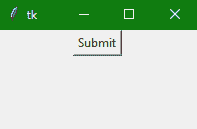
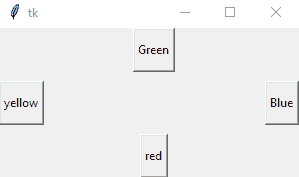
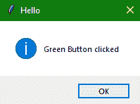

# Tkinter 按钮小部件

在本教程中，我们将介绍 Python 中 Tkinter 模块的**按钮小部件**。

Tkinter 中的**按钮小部件**主要用于**在任意 GUI 应用**中添加按钮。在 Python 中，在使用 Tkinter 按钮小部件的同时，我们可以很容易地修改按钮的样式，比如给它添加一个背景色，调整按钮的高度和宽度，或者按钮的位置等。非常容易。

*   您可以在按钮小部件的帮助下向应用添加各种类型的按钮(根据您的应用用户界面)。

*   如果您愿意，您也可以将任何**方法或函数**与按钮相关联，然后每当您按下按钮时，该方法将被调用**。**

*   **按钮小部件**有**多个选项**，您可以**根据您的要求**进行重置或设置。

## Tkinter Button Widget

按钮小部件的**语法**如下所示，

```py
W = Button(master, options) 
```

在上面的语法中，`master`参数表示**父窗口**。您可以使用许多选项来更改按钮的**外观，这些选项被写成逗号分隔的**。

### Tkinter Button Widget 选项:

以下是 tkinter 按钮小部件使用的各种选项:

| **选项名称** | **描述** |
| --- | --- |
| `activebackground` | 该选项表示鼠标悬停在按钮上时**按钮的背景。** |
| `bd` | 该选项用于**以像素为单位表示边框**的宽度。 |
| `bg` | 该选项用于**表示按钮**的背景色。 |
| `command` | **命令选项用于设置功能调用**，该功能调用是在**调用**时安排的。 |
| `activeforeground` | 该选项主要**代表**鼠标悬停在**按钮时按钮的字体颜色**。 |
| `fg` | 该选项代表按钮的**前景色。** |
| `font` | 该选项指示按钮的字体。 |
| `height` | 该选项指示按钮的高度。该高度在**文本行**的情况下表示**文本行数**，在图像的情况下表示**像素数**。 |
| `image` | 该选项指示按钮上显示的图像。 |
| `higlightcolor` | 此选项指示按钮上有焦点时的高亮颜色 |
| `justify` | 该选项用于指示多条文本行的表示方式**。对于左对齐，它设置为左对齐，对于右对齐，它设置为右对齐，对于中心对齐，它设置为中心对齐。** |
| `padx` | 该选项表示按钮在**水平方向**的附加填充。 |
| `pady` | 该选项表示按钮在**垂直方向**的附加填充。 |
| `underline` | 该选项用于**给按钮**的文本加下划线。 |
| `width` | 此选项指定按钮的宽度。对于文本按钮，它以若干字母的形式存在；对于图像按钮，它表示像素。 |
| `Wraplength` | 在这种情况下，如果该选项的值是**设置为正数**，文本行将被包裹**，以便适合该长度**。 |
| `state` | 该选项的值设置为**禁用**，使**按钮无响应**。激活主要代表按钮的**激活状态。** |

我们将在下面的例子中使用不同的选项。

## Tkinter 按钮小部件示例

现在让我们借助下面给出的代码片段创建一个简单的提交按钮:

```py
from tkinter import *   

win = Tk()  ## win is a top or parent window

win.geometry("200x100")  

b = Button(win, text = "Submit")  

b.pack()  #using pack() geometry

win.mainloop() 
```



在上面的代码示例中，我们创建了一个给定宽度和高度的简单窗口。然后我们给它添加了一个按钮小部件，提供了作为该按钮主窗口创建的**窗口**，并为该按钮添加了一个**文本**。

### Tkinter 按钮小部件-添加样式和事件处理程序

下面是另一个代码片段，我们将通过添加更多样式来改变按钮的外观。让我们看看我们是如何做到的:

```py
import tkinter
from tkinter import *
from tkinter import messagebox

top = Tk()
top.geometry("300x150")
def click():
    messagebox.showinfo("Hello", "Green Button clicked")
a = Button(top, text="yellow", activeforeground="yellow", activebackground="orange", pady=10)
b = Button(top, text="Blue", activeforeground="blue", activebackground="orange", pady=10)
# adding click function to the below button
c = Button(top, text="Green", command=click, activeforeground = "green", activebackground="orange", pady=10)
d = Button(top, text="red", activeforeground="yellow", activebackground="orange", pady=10)

a.pack(side = LEFT)
b.pack(side = RIGHT)
c.pack(side = TOP)
d.pack(side = BOTTOM)
top.mainloop() 
```

### 

在上面的代码中，我们使用不同的选项添加了一些样式，并添加了一个事件处理程序来处理第三个按钮的 click 事件。所以每当你点击带有绿色文字的**按钮时，你会看到一个带有信息的 Tkinter 消息框。**



## 总结:

在本教程中，我们学习了如何制作一个具有各种选项的 Tkinter Button 小部件，如改变按钮的样式、向按钮添加文本或定位按钮。我们还看到了一个代码示例，它向任何按钮添加一个事件处理函数，以便在单击按钮时执行一些操作。

* * *

* * *