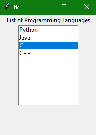

# Tkinter `Listbox`小部件

在本教程中，我们将介绍 Python 中的 Tkinter **Listbox 小部件**，该小部件用于在一个框内以列表的形式向用户显示**不同类型的项目**，用户可以选择这些项目。

*   项目包含**同类型字体**和**同字体颜色**。

*   这里需要注意的是**只有文本项**可以放在**列表框小部件**中。

*   从这个项目列表中，**用户可以根据需要选择一个或多个项目**。

## Tkinter Listbox Widget

Tkinter Listbox 小部件的**语法**如下所示:

```py
W = Listbox(master, options) 
```

在上面的语法中，`master`参数表示**父窗口。**您可以使用许多`options`来更改列表框的**外观，这些**选项**被写成**逗号分隔的键值对**。**

### Tkinter Listbox Widget 选项:

下面是列表框小部件使用的各种选项:

| 期权名称 | 描述 |
| --- | --- |
| `bg` | 该选项指示小部件的**背景颜色**。 |
| `bd` | 该选项用于表示边框的**大小。默认值为 2 像素。** |
| `cursor` | 借助该选项，**鼠标指针看起来会像点、箭头等光标类型一样**。 |
| `font` | 该选项指示列表框项目的**字体类型。** |
| `fg` | 该选项指示文本的**颜色。** |
| `height` | 该选项用于表示列表框中显示的行的**计数。该选项的默认值为 10。** |
| `highlightcolor` | 当窗口小部件处于**焦点下**时，该选项用于**指示列表框项目**的颜色。 |
| `highlightthickness` | 该选项用于指示高光的**厚度。** |
| `relief` | 此选项指示边框的类型。默认值为**凹陷**。 |
| `selectbackground` | 该选项用于指示**背景颜色**，该颜色用于显示**所选文本**。 |
| `selectmode` | 此选项用于确定可从列表中选择的项目数量。可以设置为**浏览**、**单个**、**多个**、**扩展**。 |
| `width` | 该选项用于以字符表示小部件的**宽度。** |
| `xscrollcommand` | 该选项用于让**用户水平滚动列表框**。 |
| `yscrollcommand` | 该选项用于让**用户垂直滚动列表框**。 |

### Tkinter 列表框小部件方法:

以下是与列表框小部件相关联的方法:

| 方法 | 描述 |
| --- | --- |
| `activate(index)` | 此方法主要用于选择指定索引处的行。 |
| `curselection()` | 此方法用于返回包含所选元素行号的元组，从 0 开始计数。如果未选择任何内容，则返回一个空元组。 |
| `delete(first, last = None)` | 此方法用于删除给定范围内存在的行。 |
| `get(first, last = None)` | 此方法用于获取给定范围内存在的项目列表。 |
| `index(i)` | 此方法用于将带有指定索引的行放在小部件的顶部。 |
| `insert(index, *elements)` | 此方法用于在指定索引之前插入具有指定元素数的新行。 |
| `nearest(y)` | 此方法用于返回列表框小部件 y 坐标的最近行的索引。 |
| `see(index)` | 此方法用于调整列表框的位置，使索引指定的行可见。 |
| `size()` | 此方法返回列表框小部件中的行数。 |
| `xview()` | 此方法用于使小部件水平滚动。 |
| `xview_moveto(fraction)` | 此方法用于使列表框水平滚动列表框中最长线条宽度的一部分。 |
| `xview_scroll(number, what)` | 此方法用于使列表框水平滚动指定的字符数。 |
| `yview()` | 此方法允许列表框垂直滚动。 |
| `yview_moveto(fraction)` | 此方法用于使列表框垂直滚动列表框中最长线条宽度的一部分。 |
| `yview_scroll (number, what)` | 此方法用于使列表框垂直滚动指定的字符数。 |

## Tkinter 列表框小部件示例

下面我们有一个使用这个小部件的基本例子:

```py
from tkinter import *

top = Tk()

top.geometry("200x250")

lbl = Label(top, text="List of Programming Languages")

listbox = Listbox(top)

listbox.insert(1,"Python")

listbox.insert(2, "Java")

listbox.insert(3, "C")

listbox.insert(4, "C++")

lbl.pack()
listbox.pack()

top.mainloop() 
```



在上面的代码示例中，我们创建了一个简单的 Listbox 小部件，其中包含一些项目，并指定了列表框小部件上的顶部列表项目(标题)。

## 总结:

在本教程中，我们了解了 Tkinter Listbox 小部件、其基本语法、Listbox 小部件的常用方法以及一个代码示例。

* * *

* * *