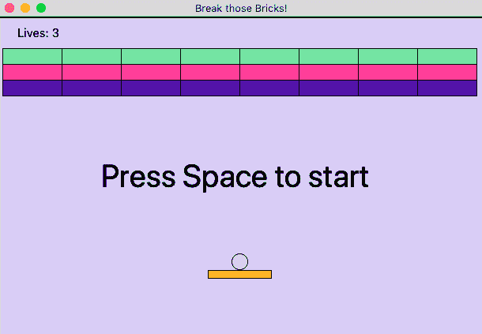
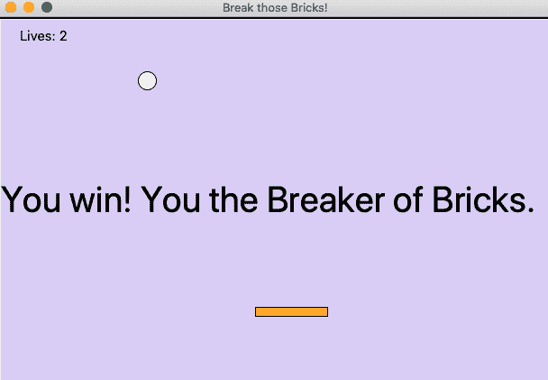
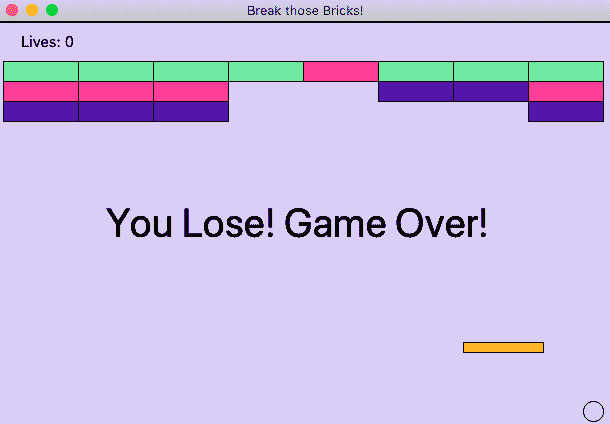

# Tkinter 打砖块游戏（Python 项目）

> 原文：<https://www.studytonight.com/tkinter/brick-breaker-game-using-tkinter-python-project>

是时候用 Python 编写一个游戏了。我们将从一个简单的打砖块游戏开始，在这个游戏中，有一个球从一个平台反弹回来打破砖墙，玩家必须通过确保球拍始终在那里将球反弹回来来保持球的前进。

游戏将有三层砖块，每层砖块的命中能力不同，这意味着一些砖块会在**单次命中**时破碎，一些会要求**双次命中**，一些会要求**三次命中**。



为了简化游戏的逻辑和用户界面，下面是砖块的类型:

**青砖:**需要三击才能破

**粉色砖块:**需要两击才能破

**紫砖:**需要三击才能破

## 先决条件:

要理解 Python 中构建砖块断路器游戏的代码，您应该知道以下概念:

*   [用 Python 创建类](https://www.studytonight.com/python/class-in-python)

*   [Python 中类的构造器](https://www.studytonight.com/python/constructors-in-python)

*   [Python 中的继承](https://www.studytonight.com/python/inheritance-in-python)

*   [Python 中的访问修饰符](https://www.studytonight.com/python/access-modifier-python)

*   [`__name__`为 Python 中的主要方法](https://www.studytonight.com/python/_name_-as-main-method-in-python)

除此之外，还需要对 Python 有全面的了解，这也可以从我们的免费教程系列中获得 **[学习 Python](https://www.studytonight.com/python/)** 。

## 打砖块游戏的代码

我们将在代码中创建 5 个类，类的名称是:

1.  游戏对象

2.  球

3.  涉水

4.  砖

5.  比赛

所有这些类都有方法在各自的游戏元素上执行各种处理和操作。

让我们看看每个类的代码。

### 游戏对象类

这个类是所有其他类的父类，这意味着所有其他类都将继承这个类。

这个类的代码如下:

```py
class GameObject(object):
    def __init__(self, canvas, item):
        self.canvas = canvas
        self.item = item

    def get_position(self):
        return self.canvas.coords(self.item)

    def move(self, x, y):
        self.canvas.move(self.item, x, y)

    def delete(self):
        self.canvas.delete(self.item)
```

这个类具有处理构成游戏的不同对象的基本生命周期的功能。

### 球类

下面是 Ball 类的代码:

```py
class Ball(GameObject):
    def __init__(self, canvas, x, y):
        self.radius = 10
        self.direction = [1, -1]
        # increase the below value to increase the speed of ball
        self.speed = 5
        item = canvas.create_oval(x-self.radius, y-self.radius,
                                  x+self.radius, y+self.radius,
                                  fill='white')
        super(Ball, self).__init__(canvas, item)

    def update(self):
        coords = self.get_position()
        width = self.canvas.winfo_width()
        if coords[0] <= 0 or coords[2] >= width:
            self.direction[0] *= -1
        if coords[1] <= 0:
            self.direction[1] *= -1
        x = self.direction[0] * self.speed
        y = self.direction[1] * self.speed
        self.move(x, y)

    def collide(self, game_objects):
        coords = self.get_position()
        x = (coords[0] + coords[2]) * 0.5
        if len(game_objects) > 1:
            self.direction[1] *= -1
        elif len(game_objects) == 1:
            game_object = game_objects[0]
            coords = game_object.get_position()
            if x > coords[2]:
                self.direction[0] = 1
            elif x < coords[0]:
                self.direction[0] = -1
            else:
                self.direction[1] *= -1

        for game_object in game_objects:
            if isinstance(game_object, Brick):
                game_object.hit()
```

在球类中，`collide()`方法用于处理碰撞，并在游戏类的 check _ conflicts()函数中使用。而`update()`功能是在失去生命后重置球对象，游戏重新开始。

### 桨类

以下是 Paddle 类的代码:

```py
class Paddle(GameObject):
    def __init__(self, canvas, x, y):
        # set the shape and position of paddle
        self.width = 80
        self.height = 10
        self.ball = None
        item = canvas.create_rectangle(x - self.width / 2,
                                       y - self.height / 2,
                                       x + self.width / 2,
                                       y + self.height / 2,
                                       fill='#FFB643')
        super(Paddle, self).__init__(canvas, item)

    def set_ball(self, ball):
        self.ball = ball

    def move(self, offset):
        coords = self.get_position()
        width = self.canvas.winfo_width()
        if coords[0] + offset >= 0 and coords[2] + offset <= width:
            super(Paddle, self).move(offset, 0)
            if self.ball is not None:
                self.ball.move(offset, 0)
```

除了构造器之外，这个类中的`move()`方法也很重要，因为**可以使桨**运动。

### 砖块类

下面是 Brick 类的代码:

```py
class Brick(GameObject):
    COLORS = {1: '#4535AA', 2: '#ED639E', 3: '#8FE1A2'}

    def __init__(self, canvas, x, y, hits):
        self.width = 75
        self.height = 20
        self.hits = hits
        color = Brick.COLORS[hits]
        item = canvas.create_rectangle(x - self.width / 2,
                                       y - self.height / 2,
                                       x + self.width / 2,
                                       y + self.height / 2,
                                       fill=color, tags='brick')
        super(Brick, self).__init__(canvas, item)

    def hit(self):
        self.hits -= 1
        if self.hits == 0:
            self.delete()
        else:
            self.canvas.itemconfig(self.item,
                                   fill=Brick.COLORS[self.hits])
```

我们通过设置不同砖块类型的颜色来开始类定义。然后在构造器中，定义砖块的大小和位置。然后是`hit()`功能，处理砖块是会消失还是会承受打击，改变颜色承受下一次打击。

### 游戏课

这是控制一切的主类。下面是代码:

```py
class Game(tk.Frame):
    def __init__(self, master):
        super(Game, self).__init__(master)
        self.lives = 3
        self.width = 610
        self.height = 400
        self.canvas = tk.Canvas(self, bg='#D6D1F5',
                                width=self.width,
                                height=self.height,)
        self.canvas.pack()
        self.pack()

        self.items = {}
        self.ball = None
        self.paddle = Paddle(self.canvas, self.width/2, 326)
        self.items[self.paddle.item] = self.paddle
        # adding brick with different hit capacities - 3,2 and 1
        for x in range(5, self.width - 5, 75):
            self.add_brick(x + 37.5, 50, 3)
            self.add_brick(x + 37.5, 70, 2)
            self.add_brick(x + 37.5, 90, 1)

        self.hud = None
        self.setup_game()
        self.canvas.focus_set()
        self.canvas.bind('<Left>',
                         lambda _: self.paddle.move(-10))
        self.canvas.bind('<Right>',
                         lambda _: self.paddle.move(10))

    def setup_game(self):
           self.add_ball()
           self.update_lives_text()
           self.text = self.draw_text(300, 200,
                                      'Press Space to start')
           self.canvas.bind('<space>', lambda _: self.start_game())

    def add_ball(self):
        if self.ball is not None:
            self.ball.delete()
        paddle_coords = self.paddle.get_position()
        x = (paddle_coords[0] + paddle_coords[2]) * 0.5
        self.ball = Ball(self.canvas, x, 310)
        self.paddle.set_ball(self.ball)

    def add_brick(self, x, y, hits):
        brick = Brick(self.canvas, x, y, hits)
        self.items[brick.item] = brick

    def draw_text(self, x, y, text, size='40'):
        font = ('Forte', size)
        return self.canvas.create_text(x, y, text=text,
                                       font=font)

    def update_lives_text(self):
        text = 'Lives: %s' % self.lives
        if self.hud is None:
            self.hud = self.draw_text(50, 20, text, 15)
        else:
            self.canvas.itemconfig(self.hud, text=text)

    def start_game(self):
        self.canvas.unbind('<space>')
        self.canvas.delete(self.text)
        self.paddle.ball = None
        self.game_loop()

    def game_loop(self):
        self.check_collisions()
        num_bricks = len(self.canvas.find_withtag('brick'))
        if num_bricks == 0: 
            self.ball.speed = None
            self.draw_text(300, 200, 'You win! You the Breaker of Bricks.')
        elif self.ball.get_position()[3] >= self.height: 
            self.ball.speed = None
            self.lives -= 1
            if self.lives < 0:
                self.draw_text(300, 200, 'You Lose! Game Over!')
            else:
                self.after(1000, self.setup_game)
        else:
            self.ball.update()
            self.after(50, self.game_loop)

    def check_collisions(self):
        ball_coords = self.ball.get_position()
        items = self.canvas.find_overlapping(*ball_coords)
        objects = [self.items[x] for x in items if x in self.items]
        self.ball.collide(objects)
```

在本课中，我们有以下内容:

1.  我们定义了生命的数量，游戏的背景颜色，以及游戏窗口的其他样式。

2.  游戏设置由这个类完成。

3.  添加砖块，添加桨，球和文本是由这个类完成的。

4.  对生活的处理由这个班负责。

5.  开始游戏和运行游戏循环，也是在这堂课上完成的。

## 打砖块游戏的完整代码:

这是游戏的完整代码。

```py
import tkinter as tk

class GameObject(object):
    def __init__(self, canvas, item):
        self.canvas = canvas
        self.item = item

    def get_position(self):
        return self.canvas.coords(self.item)

    def move(self, x, y):
        self.canvas.move(self.item, x, y)

    def delete(self):
        self.canvas.delete(self.item)

class Ball(GameObject):
    def __init__(self, canvas, x, y):
        self.radius = 10
        self.direction = [1, -1]
        # increase the below value to increase the speed of ball
        self.speed = 5
        item = canvas.create_oval(x-self.radius, y-self.radius,
                                  x+self.radius, y+self.radius,
                                  fill='white')
        super(Ball, self).__init__(canvas, item)

    def update(self):
        coords = self.get_position()
        width = self.canvas.winfo_width()
        if coords[0] <= 0 or coords[2] >= width:
            self.direction[0] *= -1
        if coords[1] <= 0:
            self.direction[1] *= -1
        x = self.direction[0] * self.speed
        y = self.direction[1] * self.speed
        self.move(x, y)

    def collide(self, game_objects):
        coords = self.get_position()
        x = (coords[0] + coords[2]) * 0.5
        if len(game_objects) > 1:
            self.direction[1] *= -1
        elif len(game_objects) == 1:
            game_object = game_objects[0]
            coords = game_object.get_position()
            if x > coords[2]:
                self.direction[0] = 1
            elif x < coords[0]:
                self.direction[0] = -1
            else:
                self.direction[1] *= -1

        for game_object in game_objects:
            if isinstance(game_object, Brick):
                game_object.hit()

class Paddle(GameObject):
    def __init__(self, canvas, x, y):
        self.width = 80
        self.height = 10
        self.ball = None
        item = canvas.create_rectangle(x - self.width / 2,
                                       y - self.height / 2,
                                       x + self.width / 2,
                                       y + self.height / 2,
                                       fill='#FFB643')
        super(Paddle, self).__init__(canvas, item)

    def set_ball(self, ball):
        self.ball = ball

    def move(self, offset):
        coords = self.get_position()
        width = self.canvas.winfo_width()
        if coords[0] + offset >= 0 and coords[2] + offset <= width:
            super(Paddle, self).move(offset, 0)
            if self.ball is not None:
                self.ball.move(offset, 0)

class Brick(GameObject):
    COLORS = {1: '#4535AA', 2: '#ED639E', 3: '#8FE1A2'}

    def __init__(self, canvas, x, y, hits):
        self.width = 75
        self.height = 20
        self.hits = hits
        color = Brick.COLORS[hits]
        item = canvas.create_rectangle(x - self.width / 2,
                                       y - self.height / 2,
                                       x + self.width / 2,
                                       y + self.height / 2,
                                       fill=color, tags='brick')
        super(Brick, self).__init__(canvas, item)

    def hit(self):
        self.hits -= 1
        if self.hits == 0:
            self.delete()
        else:
            self.canvas.itemconfig(self.item,
                                   fill=Brick.COLORS[self.hits])

class Game(tk.Frame):
    def __init__(self, master):
        super(Game, self).__init__(master)
        self.lives = 3
        self.width = 610
        self.height = 400
        self.canvas = tk.Canvas(self, bg='#D6D1F5',
                                width=self.width,
                                height=self.height,)
        self.canvas.pack()
        self.pack()

        self.items = {}
        self.ball = None
        self.paddle = Paddle(self.canvas, self.width/2, 326)
        self.items[self.paddle.item] = self.paddle
        # adding brick with different hit capacities - 3,2 and 1
        for x in range(5, self.width - 5, 75):
            self.add_brick(x + 37.5, 50, 3)
            self.add_brick(x + 37.5, 70, 2)
            self.add_brick(x + 37.5, 90, 1)

        self.hud = None
        self.setup_game()
        self.canvas.focus_set()
        self.canvas.bind('<Left>',
                         lambda _: self.paddle.move(-10))
        self.canvas.bind('<Right>',
                         lambda _: self.paddle.move(10))

    def setup_game(self):
           self.add_ball()
           self.update_lives_text()
           self.text = self.draw_text(300, 200,
                                      'Press Space to start')
           self.canvas.bind('<space>', lambda _: self.start_game())

    def add_ball(self):
        if self.ball is not None:
            self.ball.delete()
        paddle_coords = self.paddle.get_position()
        x = (paddle_coords[0] + paddle_coords[2]) * 0.5
        self.ball = Ball(self.canvas, x, 310)
        self.paddle.set_ball(self.ball)

    def add_brick(self, x, y, hits):
        brick = Brick(self.canvas, x, y, hits)
        self.items[brick.item] = brick

    def draw_text(self, x, y, text, size='40'):
        font = ('Forte', size)
        return self.canvas.create_text(x, y, text=text,
                                       font=font)

    def update_lives_text(self):
        text = 'Lives: %s' % self.lives
        if self.hud is None:
            self.hud = self.draw_text(50, 20, text, 15)
        else:
            self.canvas.itemconfig(self.hud, text=text)

    def start_game(self):
        self.canvas.unbind('<space>')
        self.canvas.delete(self.text)
        self.paddle.ball = None
        self.game_loop()

    def game_loop(self):
        self.check_collisions()
        num_bricks = len(self.canvas.find_withtag('brick'))
        if num_bricks == 0: 
            self.ball.speed = None
            self.draw_text(300, 200, 'You win! You the Breaker of Bricks.')
        elif self.ball.get_position()[3] >= self.height: 
            self.ball.speed = None
            self.lives -= 1
            if self.lives < 0:
                self.draw_text(300, 200, 'You Lose! Game Over!')
            else:
                self.after(1000, self.setup_game)
        else:
            self.ball.update()
            self.after(50, self.game_loop)

    def check_collisions(self):
        ball_coords = self.ball.get_position()
        items = self.canvas.find_overlapping(*ball_coords)
        objects = [self.items[x] for x in items if x in self.items]
        self.ball.collide(objects)

if __name__ == '__main__':
    root = tk.Tk()
    root.title('Break those Bricks!')
    game = Game(root)
    game.mainloop()
```

要运行游戏，您必须安装 Tkinter 模块。将上面给出的代码保存在一个有名字的文件中，比如说**碎砖工. py** 文件。然后要运行代码，请执行以下命令:

```py
python brick-breaker.py
```

## 打砖块游戏界面:

以下是游戏外观的一些快照。

当**玩家赢得**游戏时:



当**玩家输掉**游戏时:



至此，本教程结束。希望游戏对你来说没问题。我们建议您编辑和定制代码，使游戏更好。尝试为游戏添加更多功能。

* * *

* * *