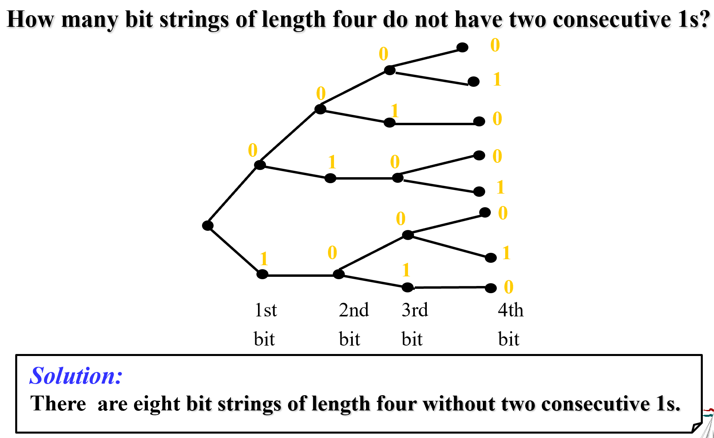
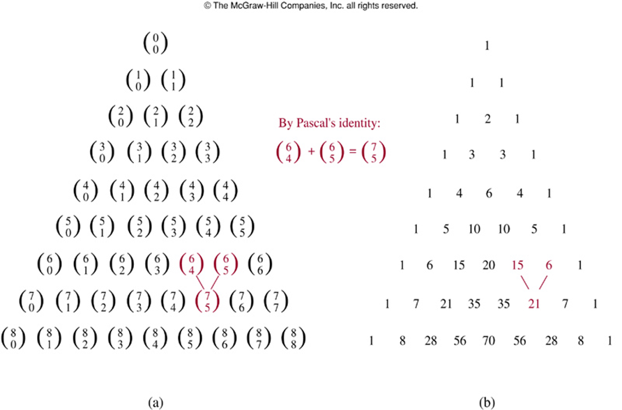

 Chaptcer 06 Counting 计数

Part 01 The Basic of Counting 计数基础

covering 6.1、6.3、6.4

---

# Basic Counting Principles 基本计数原理

## The Sum Rule 加法原理

If a first task can be done in $n_1$ ways and a second task in $n_2$ ways, and if these tasks cannot be done at the same time, then there are $n_1+n_2$ ways to do one of these tasks. 

### Phrased in terms of sets

If *S* and *T* are two disjoint finite sets, then the number of elements in the union of these sets is the sum of numbers of elements in them, namely $|S\cup T|=|S|+|T|$

> **Note**: 
>
> If S and T have common elements, then we should use the  inclusion-Exclusion principle (Subtraction Rule). 

### The extended version of the sum rule

We can extend the sum rule to more than two tasks.

Suppose that the tasks $T_1,T_2,…,T_m$ can be done in $n_1,n_2,…,n_m$ ways, respectively, and no two of these tasks can be done at the same time. Then the number of ways to do one of these tasks is $n_1+n_2+…+n_m$.

$|A_1\cup A_2\cup...\cup A_n|=|A_1|+|A_2|+...+|A_n|$

($A_i\cap A_j=\emptyset(i\neq j,\ i,j=1,2,…,n)$)

## The Product Rule 乘法原理

Suppose that a procedure can be broken down into two tasks. If there are $n_1$ ways to do the first task and $n_2$ ways to do the second after the first task has been done, then there are $n_1n_2$ ways to complete the procedure. 

### Phrased in terms of sets

If S and T are finite sets, then the number of elements in the Cartesian product of these sets is the product of the  number of elements in each set, namely $|S\times T|=|S|\cdot|T|$

### The extended version of the product rule

$|A_1\times A_2\times...\times A_n|=|A_1||A_2|...|A_n|$

## Subtraction Rule 减法原理

Also known as **the Inclusion-Exclusion Principle**

$|A\cup B|=|A|+|B|-|A\cap B|$

## Division Rule 除法原理

There are **n/d** ways to do a task if it can be done using a procedure that can be carried out in n ways, and for every way w, exactly d of the nways correspond to way w.

这么说太抽象了，具体来说就是把平行、对称、对偶的情形除去，如果举一个例子的话就是**环排列**

## Tree Diagrams 树状图

To use trees in counting, we use a branch to represent each possible choice. We represent the possible outcomes by the leaves. 

# Permutations and Combinations 排列&组合

## Permutations 排列

### Definition 定义

A **permutation** of a set of **distinct** objects is an **ordered** arrangement of these objects.

An **r-permutation** is an ordered arrangement of r elements of a set. 

**Notation**: $P(n,r)$

### Theorem 定理

$
P(n,r)=n(n-1)(n-2)...(n-r+1)=\frac{n!}{(n-r)!}
$

This theorem can be proved by **the product rule**.

### Phrased in terms of functions 函数表示

$
B=\left\{b_{1}, b_{2}, \ldots, b_{r}\right\} \quad A=\left\{a_{1}, a_{2}, \cdots, a_{n}\right\} \quad f : B \rightarrow A
$

1. f  is an injection from B to A $\Leftrightarrow$ an r-permutation of the set A 
2. the number of injections from B to A $\Leftrightarrow$ P(n, r) 

## Combinations 组合

### Definition 定义

An **r-combination** of elements of a set is an **unordered** selection of r elements from the set. 

> **Note**: An r-combination is simply a subset of the set with r elements. 

**Notation**: $C(n, r)=\left( \begin{array}{l}{n} \\ {r}\end{array}\right)$

### Theorem 定理

$
C(n,r)=\frac{n !}{r !(n-r) !}=n(n-1)(n-2) \dots(n-r+1) / r !
$

### Phrased in terms of functions 函数表示

$
A=\left\{a_{1}, a_{2}, \cdots, a_{n}\right\}, B=\{0,1\}, f : A \rightarrow B
$

f is the function from A to B such that the image of r elements in A is 1 $\Leftrightarrow$ An r-combination of A. 
$
C(n, r)=|\{f|f : A \rightarrow B \wedge r=|\{a|a \in A\wedge f(a)=1\}|\} |
$

### Corollary 推论

$C(n,r)=C(n,n-r)$

## Combinatorial Proofs  组合证明

A **combinatorial proof** of an identity is a proof that uses one of the following methods.

### Double Counting Proof 双计数证明

A **double counting proof** uses counting arguments to prove that both sides of an identity count the same objects, but in different ways.

### Bijective Proof 双射证明

A **bijective proof** shows that there is a bijection between the sets of objects counted by the two sides of the identity.

> e.g. Prove $C(n,r)=C(n,n-r)$
>
> > Double Counting Proof
> >
> > counting the possible sets $A$ is equivelent to counting the set $\overline{A}$
>
> > Bijective Proof
> >
> > $A\to\overline{A}$ is a bijection from a set containing r elements to a set containing (n-r) elements

# Binomial Coefficients 二项式系数

## The Binomial Theorem 二项式定理

Let *x* and *y* be varaibles, and let  *n* be a nonnegative integer, then we have
$
(x+y)^{n}=\sum_{j=0}^{n} \left( \begin{array}{l}{n} \\ {j}\end{array}\right) x^{n-j} y^{j}
$

### Corollary 1 推论 1

$
\sum_{k=0}^{n} \left( \begin{array}{l}{n} \\ {k}\end{array}\right)=2^{n}
$

(x = y = 1 or use combinatorial proof)

### Corollary 2 推论 2

$
\sum_{k=0}^{n}(-1)^{k} \left( \begin{array}{l}{n} \\ {k}\end{array}\right)=0
$

(x = 1, y = -1)

> **Note**:
>
> By this corollary, we have
> $
> \left( \begin{array}{l}{n} \\ {0}\end{array}\right)+\left( \begin{array}{l}{n} \\ {2}\end{array}\right)+\left( \begin{array}{l}{n} \\ {4}\end{array}\right)+\ldots=\left( \begin{array}{l}{n} \\ {1}\end{array}\right)+\left( \begin{array}{l}{n} \\ {3}\end{array}\right)+\left( \begin{array}{l}{n} \\ {5}\end{array}\right)+\ldots
> $

### Corollary 3 推论 3

$
\sum_{k=0}^{n} 2^{k} \left( \begin{array}{l}{n} \\ {k}\end{array}\right)=3^{n}
$

(x = 1, y = 2)

## PASCAL’S Identity 帕斯卡恒等式

Let $n$ and $k$ be positive integers with $k\leq n$, then
$
\left( \begin{array}{c}{n+1} \\ {k}\end{array}\right)=\left( \begin{array}{c}{n} \\ {k-1}\end{array}\right)+\left( \begin{array}{l}{n} \\ {k}\end{array}\right)
$

> Proof:
>
> Assume we have a set $A=\left\{x, a_{1}, a_{2}, \cdots, a_{n}\right\}$
>
> The left side means the number of subsets of size k from set A
>
> The right side counts this in another way:
>
> > 1. the subsets that contain x $\left( \begin{array}{c}{n} \\ {k-1}\end{array}\right)$
> > 2. the subsets that don’t contain x $\left( \begin{array}{l}{n} \\ {k}\end{array}\right)$

### Pascal's Triangle 帕斯卡三角形

## Vandermonde’s Identity 范德蒙德恒等式

Let m, n and r be nonnegative integer with r not exceeding either m or n, then
$
\left( \begin{array}{c}{m+n} \\ {r}\end{array}\right)=\sum_{k=0}^{r} \left( \begin{array}{c}{m} \\ {r-k}\end{array}\right) \left( \begin{array}{l}{n} \\ {k}\end{array}\right)
$

> **Proof**:
> Assume A and B are two disjoint sets and |A|=m, |B|=n
>
> The left side means the number of ways to pick r elements from $A\cup B$
>
> The right side counts the same thing in another way: pick r-k elements from A and then k elements from B, where $0\leq k\leq r$, and sum all these numbers up

### Corollary 4 推论 4

$
\left( \begin{array}{c}{2 n} \\ {n}\end{array}\right)=\sum_{k=0}^{n} \left( \begin{array}{l}{n} \\ {k}\end{array}\right)^{2}
$

(Let m = r = n, $\left( \begin{array}{c}{2 n} \\ {n}\end{array}\right)=\sum_{k=0}^{n} \left( \begin{array}{c}{n} \\ {n-k}\end{array}\right) \left( \begin{array}{l}{n} \\ {k}\end{array}\right)=\sum_{k=0}^{n} \left( \begin{array}{l}{n} \\ {k}\end{array}\right)^{2}​$)

## Another Identity “无名”恒等式

Let n and r be nonnegative integer with $r\leq n$, then
$
\left( \begin{array}{l}{n+1} \\ {r+1}\end{array}\right)=\sum_{j=r}^{n} \left( \begin{array}{l}{j} \\ {r}\end{array}\right)
$

> **Proof**:
>
> Use ***bit string***
>
> The left-hand side counts the bit strings of length (n+1) containing (r+1) 1s
>
> The right-hand side counts the same objects by considering the cases corresponding to the possible locations of the final 1 in a string with (r+1) ones  ($\sum_{k=r+1}^{n+1} \left( \begin{array}{c}{k-1} \\ {r}\end{array}\right)=\sum_{j=r}^{n} \left( \begin{array}{c}{j} \\ {r}\end{array}\right)$)

