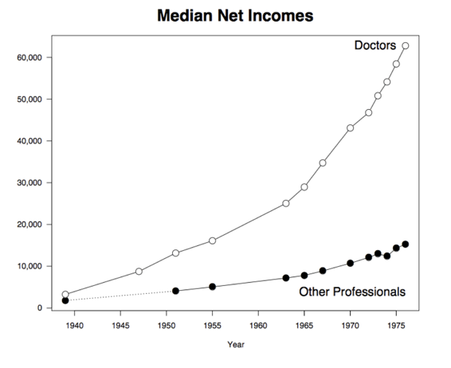
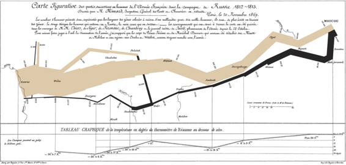
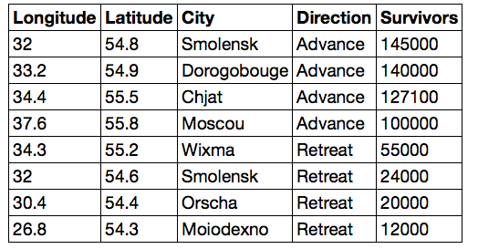

# 三、Python 编程

> 原文：[Programming in Python](https://github.com/data-8/textbook/tree/gh-pages/chapters/03)

> 译者：[飞龙](https://github.com/wizardforcel)

> 协议：[CC BY-NC-SA 4.0](http://creativecommons.org/licenses/by-nc-sa/4.0/)

> 自豪地采用[谷歌翻译](https://translate.google.cn/)

编程可以极大地提高我们收集和分析世界信息的能力，而这些信息又可以通过上一节所述的谨慎推理来发现。 在数据科学中，编写程序的目的是，指示计算机执行分析步骤。 电脑无法自行研究世界。 人们必须准确描述计算机应该执行什么步骤来收集和分析数据，这些步骤是通过程序来表达的。

## 表达式

编程语言比人类语言简单得多。 尽管如此，在任何语言中，还是有一些语法规则需要学习，这里就是我们开始的地方。 在本文中，我们将使用 Python 编程语言。 学习语法规则是必不可少的，最基本的程序中使用的规则也是更复杂程序的核心。

程序由表达式组成，向计算机描述了如何组合数据片段。 例如，乘法表达式由两个数字表达式之间的`*`符号组成。表达式，例如`3*4`，由计算机求值。在这种情况下，（IPython 中的）每个单元格中的最后一个表达式的值（求值结果）将显示在单元格下方，这里是 12。

```py
3 * 4
12
```

编程语言的语法规则是僵化的。 在 Python 中，`*`符号不能连续出现两次。 计算机不会试图解释一个与规定的表达式结构不同的表达式。 相反，它会显示`SyntaxError`错误。 语言的语法是其语法规则的集合，`SyntaxError`表示表达式结构不匹配任何语法规则。

```py
3 * * 4
  File "<ipython-input-4-d90564f70db7>", line 1
    3 * * 4
        ^
SyntaxError: invalid syntax
```

表达式的小改动可以完全改变它的含义。 下面，`*`之间的空格已被删除。 因为`**`出现在两个数字表达式之间，所以表达式是一个格式良好的指数表达式（第一个数字的第二个数字次方，`3*3*3*3`）。 符号`*`和`**`称为运算符，它们组合的值称为操作数。

```py
3 ** 4
81
```

常用操作符。 数据科学通常涉及数值的组合，而编程语言中的一组操作符，是为了使得表达式可以用于表示任何类型的算术。 在Python中，以下操作符是必不可少的。


| 表达式类型 | 运算符 | 示例 | 值 |
| --- | --- | --- | --- |
| 加法 | `+` | `2 + 3` | 5 |
| 减法 | `-` | `2 - 3` | -1 |
| 乘法 | `*` | `2 * 3` | 6 |
| 除法 | `/` | `7 / 3` | 2.66667 |
| 取余 | `%` | `7 % 3` | 1 |
| 指数 | `**` | `2 ** 0.5` | 1.41421 |

Python 表达式遵循熟悉的优先级规则，与代数中相同：乘法和除法在加法和减法之前计算。 圆括号可以用来在较大的表达式中，将较小的表达式组合在一起。

```py
1 + 2 * 3 * 4 * 5 / 6 ** 3 + 7 + 8 - 9 + 10
17.555555555555557
1 + 2 * (3 * 4 * 5 / 6) ** 3 + 7 + 8 - 9 + 10
2017.0
```

### 示例


这里是一个图表，来自 20 世纪 80 年代初期的“华盛顿邮报”（The Washington Post），试图比较几十年来医生的收入与其他专业人员的收入。 我们是否真的需要在每个条形上看到两个头（一个带有听诊器）？ 耶鲁大学教授爱德华·图夫特（Edward Tufte）是世界上量化信息可视化的专家之一，他为这种不必要的修饰创造了“垃圾图表”（chartjunk）一词。 这张图也是 Tufte 痛恨的“数据与油墨比例过低”的一个例子。


华盛顿邮报图片

最重要的是，图的横轴不是按比例绘制的。 这对条形图的形状有显着的影响。 当按规模绘制并把装饰修剪掉时，图表显示的趋势非常不同于原来明显的线性增长。 下面的优雅图表由统计系统 R 的创始人之一 Ross Ihaka 提供。



Ross Ihaka 的图片版本

在 1939 年到 1963 年间，医生的收入从 3,262 美元增加到 25,050 美元。 所以在这个时期，每年的平均收入增加了大约 900 美元。

```py
(25050 - 3262)/(1963 - 1939)
907.8333333333334
```

在 Ross Ihaka 的图表中可以看到，在这个时期，医生的收入大致呈线性上升，并且保持在一个相对稳定的水平。 正如我们刚刚计算的那样，这个比率大约是 900 美元。

但是从 1963 年到 1976 年，这个比例是三倍多：

```py
(62799 - 25050)/(1976 - 1963)
2903.769230769231
```

这就是 1963 年之后，这个图形急剧上升的原因。

本章介绍了许多类型的表达式。 学习编程需要结合学到所有的东西，调查计算机的行为。 如果你连续除两次会发生什么？ 你并不需要总是问专家（或互联网）；许多这些细节可以通过自己尝试发现。

## 数值

### 整数值

计算机为执行数值计算而设计，但是关于处理数字有一些重要的细节，每个处理定量数据的程序员都应该知道它。 Python（和大多数其他编程语言）区分两种不同类型的数字：

+   整数在 Python 语言中称为`int`值。 它们只能表示没有小数部分的整数（负数，零或正数）
+   实数在 Python 语言中被称为`float `值（或浮点值）。 他们可以表示全部或部分数字，但有一些限制。

数值的类型在展示方式上是明显的：`int`值没有小数点，`float`值总是有一个小数点。

```py
# Some int values
2
2
1 + 3
4
-1234567890000000000
-1234567890000000000
# Some float values
1.2
1.2
1.5 + 2
3.5
3 / 1
3.0
-12345678900000000000.0
-1.23456789e+19
```

当一个`float `值和一个`int`值，通过算术运算符组合在一起时，结果总是一个`float`值。 在大多数情况下，两个整数的组合形成另一个整数，但任何数字（`int`或`float`）除以另一个将是一个`float`值。 非常大或非常小的`float`值可以使用科学记数法表示。

### 浮点值

浮点值非常灵活，但他们有限制。

`float`可以表示非常大和非常小的数字。存在限制，但你很少遇到他们。
浮点数只能表示任何数字的 15 或 16 位有效数字；剩下的精度就会丢失。 这个有限的精度对于绝大多数应用来说已经足够了。
将浮点值与算术运算结合后，最后的几位数字可能不正确。 第一次遇到时，微小的舍入错误往往令人困惑。

第一个限制可以通过两种方式来观察。 如果一个计算的结果是一个非常大的数字，那么它被表示为无限大。 如果结果是非常小的数字，则表示为零。

```py
2e306 * 10
2e+307
2e306 * 100
inf
2e-322 / 10
2e-323
2e-322 / 100
0.0
```

第二个限制可以通过涉及超过 15 位有效数字的表达式来观察。 在进行任何算术运算之前，这些额外的数字被丢弃。

```py
0.6666666666666666 - 0.6666666666666666123456789
0.0
```

当两个表达式应该相等时，可以观察到第三个限制。 例如，表达式`2 ** 0.5`计算 2 的平方根，但是该值的平方不会完全恢复成 2。

```py
2 ** 0.5
1.4142135623730951
(2 ** 0.5) * (2 ** 0.5)
2.0000000000000004
(2 ** 0.5) * (2 ** 0.5) - 2
4.440892098500626e-16
```

上面的最终结果是`0.0000000000000004440892098500626`，这个数字非常接近零。 这个算术表达式的正确答案是 0，但是最后的有效数字中的一个小错误，在科学记数法中显得非常不同。 这种行为几乎出现在所有的编程语言中，因为它是在计算机上进行算术运算的标准方式的结果。

尽管`float `并不总是精确的，但它们当然是可靠的，并且在所有不同种类的计算机和编程语言中，以相同的方式工作。

## 名称

名称通过赋值语句在 Python 中得到一个值。 在赋值中，名称后面是`=`，再后面是任何表达式。 `=`右边的表达式的值被赋给名称。 一旦名称有了赋给它的值，在将来的表达式中，值会替换为这个名称。

```py
a = 10
b = 20
a + b
30
```

之前赋值的名称可以在`=`右边的表达式中使用。

```py
quarter = 1/4
half = 2 * quarter
half
0.5
```

但是，仅仅是表达式的当前值赋给了名称。 如果该值稍后改变，则由该值定义的名称将不会自动更改。

```py
quarter = 4
half
0.5
```

名称必须以字母开头，但可以包含字母和数字。 名称不能包含空格；相反，通常使用下划线字符`_`来替换每个空格。名称只在你编写的时候是有用的；程序员可以选择易于理解的名称。 通常，比起`a`和`b`，你可以创造更有意义的名字。 例如，为了描述加利福尼亚州伯克利 5 美元商品的销售税，以下名称阐明了各种相关数量的含义。

```py
purchase_price = 5
state_tax_rate = 0.075
county_tax_rate = 0.02
city_tax_rate = 0
sales_tax_rate = state_tax_rate + county_tax_rate + city_tax_rate
sales_tax = purchase_price * sales_tax_rate
sales_tax
0.475
```

## 示例：增长率

相同数量在不同时间取得的两次测量值之间的关系通常表示为增长率。 例如，美国联邦政府在 2002 年[雇用](http://www.bls.gov/opub/mlr/2013/article/industry-employment-and-output-projections-to-2022-1.htm)了 276.6 万人，在 2012 年雇用了 281.4 万人。为了计算增长率，我们必须首先决定将哪个值作为初始值。 对于随着时间变化的数值，较早的值是一个自然的选择。 然后，我们将变动值和初始值之间的差除以初始值。

```py
initial = 2766000
changed = 2814000
(changed - initial) / initial
0.01735357917570499
```

通常从两个测量值的比例中减去 1，这产生相同的值。

```py
(changed/initial) - 1
0.017353579175704903
```

这个值是 10 年间的增长率。 增长率的一个实用属性是，即使值以不同的单位表示，它们也不会改变。 所以，例如，我们可以以千人为单位，在 2002 年和 2012 年之间表达同样的关系。

```py
initial = 2766
changed = 2814
(changed/initial) - 1
0.017353579175704903
```

10 年以来，美国联邦政府的雇员人数仅增长了 1.74%。 那个时候，美国联邦政府的总支出从 2.37 万亿美元增加到 2012 年的 3.38 万亿美元。

```py
initial = 2.37
changed = 3.38
(changed/initial) - 1
0.4261603375527425
```

联邦预算增长 42.6% 远高于联邦雇员增长 1.74%。 实际上，联邦雇员的数量增长速度远远低于美国人口。美国人口同期增长 9.21%，从 2002 年的 2.8760 亿人增加到 2012 年的 3.41 亿。

```py
initial = 287.6
changed = 314.1
(changed/initial) - 1
0.09214186369958277
```

增长率可能是负值，表示某种值的下降。 例如，美国的制造业就业岗位从 2002 年 的 1530 万减少到 2012 年的 1190 万，增长率为 -22.2%。

```py
initial = 15.3
changed = 11.9
(changed/initial) - 1
-0.2222222222222222
```

年增长率是一年之内的某个数量的增长率。 年增长率为 0.035，累计十年，十年增长率为 0.41（即 41%）。

```py
1.035 * 1.035 * 1.035 * 1.035 * 1.035 * 1.035 * 1.035 * 1.035 * 1.035 * 1.035 - 1
0.410598760621121
```

相同的计算可以使用名称和指数表达。

```py
annual_growth_rate = 0.035
ten_year_growth_rate = (1 + annual_growth_rate) ** 10 - 1
ten_year_growth_rate
0.410598760621121
```

同样，十年的增长率可以用来计算等价的年增长率。 下面，`t`是两次测量值之间经过的年数。 下面计算过去 10 年联邦支出的年增长率。

```py
initial = 2.37
changed = 3.38
t = 10
(changed/initial) ** (1/t) - 1
0.03613617208346853
```

十年来的总增长率相当于每年增长 3.6%。

总之，增长率`g`用来描述`initial `（初始值）和经过一段时间`t`之后的`changed`（变化值）的相对大小。 为了计算`changed`，使用指数来重复应用增长率`g` `t`次。

```py
initial * (1 + g) ** t
```

为了计算`g`，计算总增长率的`1/t`次方并减一。

```py
(changed/initial) ** (1/t) - 1
```

## 调用表达式

调用表达式调用函数，这些函数是具名操作。 函数名称首先出现，然后是括号中的表达式。

```py
abs(-12)
12
round(5 - 1.3)
4
max(2, 2 + 3, 4)
5
```

在这最后一个例子中，`max`函数在三个参数：`2`, `5`和`4`上调用。圆括号内每个表达式的值被传递给函数，函数返回整个调用表达式的最终值。 `max`函数可以接受任意数量的参数并返回最大值。

一些函数默认是可用的，比如`abs`和`round`，但是大部分内置于 Python 语言的函数都存储在一个称为模块的函数集合中。 导入语句用于访问模块，如`math `或`operator`。

```py
import math
import operator
math.sqrt(operator.add(4, 5))
3.0
```

可以使用`+`和`**`运算符来表达等价的表达式。

```py
(4 + 5) ** 0.5
3.0
```

运算符和调用表达式可以在表达式中一起使用。 两个值之间的百分比差异用于比较一些值，它们明显既不是`initial `也不是`changed`。 例如，2014 年，佛罗里达农场生产了 27.2 亿个蛋，而爱荷华州农场生产了 162.5 亿个鸡蛋 [1]。 百分比差值是数值之差的绝对值的 100 倍，再除以它们的平均值。 在这种情况下，差值大于平均值，所以百分比差异大于 100。

> [1] <http://quickstats.nass.usda.gov/>

```py
florida = 2.72
iowa = 16.25
100*abs(florida-iowa)/((florida+iowa)/2)
142.6462836056932
```

学习不同函数的行为，是学习编程语言的重要组成部分。 Jupyter 笔记本可以帮助你记住不同函数的名称和效果。 编辑代码单元格时，在输入名称的开头之后按 Tab 键，来显示补全该名称的方式列表。 例如，在`math`后按 Tab 键，来查看`math`模块中所有可用函数。 打字将缩小选项列表的范围。 为了了解函数的更多信息，请在它的名称之后放置一个`?`。 例如，输入`math.log`将显示`math`模块中`log`函数的描述。

```py
math.log?
log(x[, base])

Return the logarithm of x to the given base.
If the base not specified, returns the natural logarithm (base e) of x.
```

示例调用中的方括号表示参数是可选的。 也就是说，可以用一个或两个参数来调用`log`。

```py
math.log(16, 2)
4.0
math.log(16)/math.log(2)
4.0
```

[Python 的内建函数](https://docs.python.org/3/library/functions.html)列表非常长，包含了许多在数据科学应用中不需要的函数。 [`math`模块中的数学函数](https://docs.python.org/3/library/math.html)列表同样很长。 本文将在上下文中介绍最重要的函数，而不是期望读者记住或理解这些列表。

### 示例

1869 年，一位名叫查尔斯·约瑟夫·米纳德（Charles Joseph Minard）的法国土木工程师，创造了一个图表，仍被认为是有史以来最伟大的图表之一。 它显示了拿破仑军队从莫斯科撤退期间的损失。 1812 年，拿破仑开始征服俄罗斯，他的军队中有超过 35 万人。 他们确实到达了莫斯科，但是沿路一直受到损失的困扰。 俄国军队不断撤退到俄罗斯深处，故意焚烧田野，并在撤退时摧毁村庄。 这使法国军队在俄罗斯冬季来临之时，没有食物或避难所。法国军队在莫斯科没有取得决定性的胜利就撤退了。 之后天气变冷，死了更多的人。 回来的人还不到一万。



Minard 的地图

这个图表绘制在东欧地图上。 它始于左端的波兰-俄罗斯边界。 浅棕色的条形表示拿破仑的军队正在向莫斯科进军，黑色的条形代表军队的撤退。 在图表的每个点上，军队的宽度与军队中士兵的数量成正比。在图表的底部，Minard 包括了回程的温度。

注意当军队撤退时，黑色条形变窄。 渡过贝尔齐纳河是个特别的灾难，你能在图表上看到吗？

由于其简单和有力，这个图标是出色的。 Minard 展示了六个变量：

+   士兵的数量
+   行军的方向
+   位置的经纬度
+   回程的温度
+   十一月和十二月的具体日期的位置

Tufte 说 Minard 的图是“可能是有史以来最好的统计图表”。

这里是 Minard 数据的一个子集，取自 Leland Wilkinson 的 The Grammar of Graphics。



Minard 的子集

每一行表示特定位置的军队状态。 列以度为单位展示经度和纬度，位置的名称，军队是前进还是撤退，以及估计的人数。

在这个表格中，连续两个地点之间的人数的最大变化是在莫斯科撤退的时候，也是最大的百分比变化。

```py
moscou = 100000
wixma = 55000
wixma - moscou
-45000
(wixma - moscou)/moscou
-0.45
```

在莫斯科的战斗中，人数下降了 45%。 换句话说，进入莫斯科的拿破仑的军队中，有几乎一半的人没有继续前进。

正如你在图表中看到的，Moiodexno 非常接近军队出发位置 Kowno。 在前进期间进入 Smolensk 的人中，只有不到 10% 的人在返回的途中到达了 Moiodexno。

```py
smolensk_A = 145000
moiodexno = 12000
(moiodexno - smolensk_A)/smolensk_A
-0.9172413793103448
```

是的，只要使用没有名称的数字就可以做这些计算。 但是这些名称使得阅读代码和解释结果变得更容易。

值得注意的是，更大的绝对变化并不总是对应更大的百分比变化。

在前进期间，从 Smolensk 到 Dorogobouge 的绝对损失是 5000 人，而撤退期间，从 Smolensk 到 Orscha 的相应损失是 4000 人。

然而，Smolensk 和 Orscha 之间的百分比变化要大得多，因为，在撤退期间，Smolensk 的人员总数要小得多。

```py
dorogobouge = 140000
smolensk_R = 24000
orscha = 20000
abs(dorogobouge - smolensk_A)
5000
abs(dorogobouge - smolensk_A)/smolensk_A
0.034482758620689655
abs(orscha - smolensk_R)
4000
abs(orscha - smolensk_R)/smolensk_R
0.16666666666666666
```
