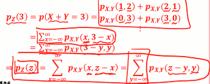
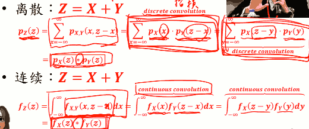
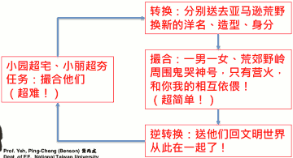
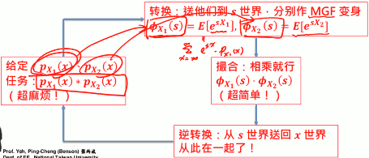
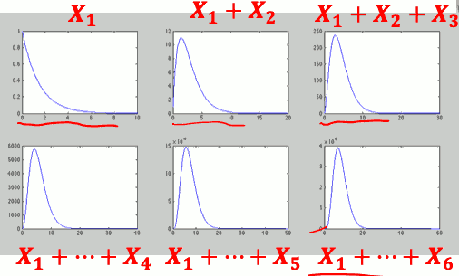
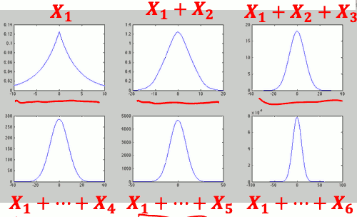
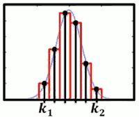
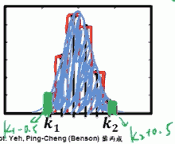

[](...menustart)

- [Week 9 多个随机变数之和的概率分布](#1762299309d6cb253f2fdb43d353f294)
    - [9.1 随机变数之和](#193f6cd419c84d21dae97441a455bb44)
    - [9.2 MGF(MOMENT GENERATING FUNCTION)](#09fcfdc987674ca8b8ddac2800de6f82)
        - [MGF](#cdd64cb797821d59ddd73236bda46533)
        - [MFG重要性质](#f8dbbf3c577f493b3b6ff0bffd301e3f)
        - [常见离散概率分布 之 MGF](#2be4a5f7d9346b585956a97eade6ba53)
        - [常见连续概率分布之 MGF](#a143407576e230d845a8f65a6a5354f9)
    - [9.3 多个随机变数之和](#cd35de7f4e9cf36be5b82a16fe6c9164)
        - [独立随机变数之和](#5394b4fb8d4f5a0a0bb2b7475ea106d6)
        - [随机个数个 独立随机变数之和](#665c6ab9ba9d1f2d7fadf5c4ff5cd580)
    - [9.4 中央極限定理-萬佛朝宗](#7578c5441d21a59eddc6f9dcf8436a1c)
        - [中央极限定律(CLT)的应用](#3a6f6a5a83db8d71e439b1482fd9d360)
    - [Quiz](#ab458f4b361834dd802e4f40d31b5ebc)

[](...menuend)


<h2 id="1762299309d6cb253f2fdb43d353f294"></h2>

# Week 9 多个随机变数之和的概率分布

<h2 id="193f6cd419c84d21dae97441a455bb44"></h2>

## 9.1 随机变数之和

- Z = X + Y 的几率分布？
- Ex: 老张面店只卖牛肉面跟豆腐脑已知每天的面销量 𝑿碗与豆腐脑销量𝒀碗的联合机率分布 p<sub>X,Y</sub>(x,y). 兄弟们约老张收摊后喝酒小聚。老婆规定老张洗完碗后才能赴约。 请问老张洗碗数量的机率分布是?
    - 
    - 第二行公式: 如果是处理 一般的问题， 比如X 可能为负数...
    - 第三行公式：若是以Y为主...
- Ex: 小明写国文作业的时间 𝑿 与算术作业 𝒀 的联合 机率分布 f<sub>X,Y</sub>(x,y) 。兄弟们约小明喝酒小聚 老妈规定小明写完作业后才能赴约。请问小明兄弟要等多久时间 的机率分布是? 
    - 
    - 连续随机变量的情况，求和变积分
- 若 X,Y独立？
    - 
    - 如果你知道X，Y的PMF，而且X，Y独立，那么X+Y的新的PMF就是等于 X的PMF，Y的PMF两个在做 
        - discrete convolution: p<sub>X</sub>(z)*p<sub>Y</sub>(z)
- 如果有不止 两个随机变量？
    - X = X₁+X₂+...+X<sub>n</sub>
    - 若 X₁+X₂+...+X<sub>n</sub> 独立:
        - 

- Convolution 很难算，怎么办?
    - MGF !!!
    - 如果你会用 MGF的话，哇，convolution 太简单了，甚至有时候算都不用算.


<details>
<summary>
Example: Jack’s Car Rental
</summary>

```python
#!/usr/local/bin/python3
import numpy as np
from scipy import stats

"""
Jack经营着一个租车公司。
每天借出的车数量 服从 POISSON( 4 ), 归还的车数量 服从 POISSON(2)。
如果某一天 Jack公司里共20辆车， 问第二天变成19辆车的概率。
"""

def solution_sample():
    nSample = 10000000
    requests = np.random.poisson(4, nSample)
    returns = np.random.poisson( 2, nSample)
    
    # 借出的车，比归还的车多一辆
    s = requests[requests - returns == 1]
    prob = len(s)/nSample

    return prob

def solution_sum():
    s = [ stats.poisson.pmf( i,4 )* stats.poisson.pmf( i-1,2 )  for i in range(20) ] 
    return sum(s)


if __name__ == '__main__':
    print( "solution sample: {}".format( solution_sample() ) )
    print( "solution sum: {}".format( solution_sum() ) )

# solution sample: 0.1563523
# solution sum: 0.15640119832636357
```

</details>

<h2 id="09fcfdc987674ca8b8ddac2800de6f82"></h2>

## 9.2 MGF(MOMENT GENERATING FUNCTION)

- 先看个例子吧!辛苦的红娘业
    - 
- 回到卷积
    - 
    - 原来这个函数都是在x这个世界，因为他们都是x的函数，我们现在要把它转换到一个新世界S, MGF 就是在S世界改造出来的结果。
        - 把 x 这个函数，转换过去变成s这个函数
        - 我有 X₁的PMF了，我就可以算 X₁的任何函数的期望值了
            - Φ<sub>X₁</sub> = E[ e<sup>sX₁</sup> ] = ∑<sub>x=</sub><sup>∞</sup><sub>-∞</sub>e<sup>sx</sup>·p<sub>X₁</sub>(x)
        - 然后把 Φ<sub>X₁</sub>, Φ<sub>X₂</sub> 相乘，再逆转换 就得到我们要的结果了。
    - 为什么MGF可以做到这个？ 数据学推导出来的...
- MGF 也可以应用到多个随机变数和
    - 
    - 


<h2 id="cdd64cb797821d59ddd73236bda46533"></h2>

### MGF 

- MGF ɸ<sub>X</sub>(s) 定义:
    - 
- 逆转换怎么做 ?
    - 通常靠查表法 
    - [Table of Common Distributions](https://www.stat.tamu.edu/~twehrly/611/distab.pdf)
    - [Table of Common Distributions course note](https://nbviewer.jupyter.org/github/mebusy/course_note/blob/master/course_TaiwanU_probability%20part2%20done/distab.pdf)
- MGF 和 期望值 
    - MGF 为什么叫 **Moment** Generating Function  呢 
        - 还记得什么叫 moment吗？ E[Xⁿ] 叫做 nth moment
    - ɸ<sub>X</sub>(s) 跟 moment 有关系吗 ?
    - 离散case
        - 
    - 连续case
        - 
    - 所以這是為什麼就叫 ɸ<sub>X</sub>(s) 叫moment generating function, 因為只要有了它，你就可以生成任何一個moment，
    - **重要性质: MGF导数 求 X的期望值！！**

[Moment Generating Functions and Probability Distributions](https://daviddalpiaz.github.io/stat400sp18/notes/practice/400PracticeMGF.pdf)

[Moment Generating Functions and Probability Distributions course](https://nbviewer.jupyter.org/github/mebusy/course_note/blob/master/course_TaiwanU_probability%20part2%20done/MGF_and_PD.pdf)


<h2 id="f8dbbf3c577f493b3b6ff0bffd301e3f"></h2>

### MFG重要性质

- MGF 怎么做运算
- Y = aX + b
    - = ɸ<sub>Y</sub>(s) = E[e<sup>sY</sup>] = E[e<sup>s(aX+b)</sup>] 
    - = E[e<sup>saX</sup>·e<sup>sb</sup>]
    - = e<sup>sb</sup>·E[e<sup>saX</sup>]
    - = e<sup>sb</sup> · ɸ<sub>X</sub>(as)

- 上面的期望值里，s不是随机变量，s只是一个变量,可以用期望值运算中拿出来


<h2 id="2be4a5f7d9346b585956a97eade6ba53"></h2>

### 常见离散概率分布 之 MGF

- X~Bernoulli(p):  p<sub>X</sub>(0) = 1-p, p(1)=p
    - ɸ<sub>X</sub>(s) = E[e<sup>sX</sup>] = E[e<sup>s·0</sup>]·p(0) + E[e<sup>s·1</sup>]·p(1)
    - = 1·(1-p) + e<sup>s</sup>·p 
    - = 1-p + pe<sup>s</sup>
- X~BIN(n,p): 做n次实验，成功的次数
    - ⇒ X = X₁+X₂+ ... +X<sub>n</sub>, Xᵢ独立，Xᵢ~Bernoulli(p)
        - 原来 BIN的随机变数，可以表示成n个Bernoulli 随机变数之和
    - ⇒ ɸ<sub>X</sub>(s) = (1-p + pe<sup>s</sup>)ⁿ
- X~Geometric(p):
    - TODO
- X~Pascal(k,p): 看到第k次成功，花的总实验次数
    - ⇒ X = X₁+X₂+ ... +X<sub>n</sub>, Xᵢ独立，Xᵢ~Geometric(p)
        - 第一次成功花了多少次 + 第2次成功花了多少次 + ... 第k次成功花了多少次
    - TODO , ( ɸ<sub>Xᵢ</sub>(s) )ᵏ
- X~Poisson(a):
    - TODO
- X~UNIF(a,b):
    - 


<h2 id="a143407576e230d845a8f65a6a5354f9"></h2>

### 常见连续概率分布之 MGF


- X~Exponential(λ):
    - TODO
- X~Erlang(n,λ):
    - ⇒ X = X₁+X₂+ ... +X<sub>n</sub>, Xᵢ独立，Xᵢ~Exponential(p)

- X~UNIF(a,b):
    - TODO
- X~Gaussian(μ,σ):  (  N( μ,σ² ) )
    - e<sup>μs+σ/2·s²</sup>


<h2 id="cd35de7f4e9cf36be5b82a16fe6c9164"></h2>

## 9.3 多个随机变数之和

<h2 id="5394b4fb8d4f5a0a0bb2b7475ea106d6"></h2>

### 独立随机变数之和

- X₁,X₂, ...独立， 且各自都有一摸一样的概率分布，表示为
    - {Xᵢ}, I.I.D
    - Independently and Identically Distributed
- X = X₁+X₂+ ... +X<sub>n</sub>, **n为常数**, 请问X的几率分布?
    - 离散: p<sub>X</sub>(x) = p<sub>X₁</sub>(x)*p<sub>X₁</sub>(x)*...*p<sub>X₁</sub>(x)  (做卷积)
    - 连续: f<sub>X</sub>(x) = f<sub>X₁</sub>(x)*f<sub>X₁</sub>(x)*...*f<sub>X₁</sub>(x)  (做卷积)
    - ɸ<sub>X</sub>(s) = ( ɸ<sub>X₁</sub>(s) )ⁿ

- Ex: 将太的寿司
    - 寿司饭团的理想重量是13g， 将太出当学徒，每次抓饭量为 正态分布，μ=14,σ=3。师傅要将太每天练习做 100个寿司才能休息，做完的寿司都得自己吃掉。请问将太每天吃的饭量的几率分布？
    - Xᵢ: 第i个寿司的饭量，{Xᵢ} I.I.D.
    - Xᵢ~N(14,9) ⇒ ɸ<sub>X₁</sub>(s) = e<sup>μs+σ/2·s²</sup> = e<sup>14s+9/2·s²</sup>
    - X = X₁+X₂+ ... +X₁₀₀
        - ⇒ ɸ<sub>X</sub>(s) = ( ɸ<sub>X₁</sub>(s) )¹⁰⁰ = ( e<sup>14s+9/2·s²</sup> )¹⁰⁰ = e<sup>1400s+900/2·s²</sup> -> N(1400,900)
        - ⇒ X~N(1400,900)

<h2 id="665c6ab9ba9d1f2d7fadf5c4ff5cd580"></h2>

### 随机个数个 独立随机变数之和

- X₁,X₂,... I.I.D.
    - X = X₁+X₂+ ... +X<sub>N</sub>
    - 若N本身也是**随机变数，其几率分布已知**， 那X的几率分布找的到吗？
- N: p<sub>N</sub>(n) 已知
    - 我们可以得到它的 MGF, 这里我们用 s֮ 来代替s ( 因为ɸ<sub>X</sub> 会用到s )
    - ⇒ ɸ<sub>N</sub>(s֮) = ∑<sub>n=0</sub><sup>∞</sup> e<sup>s֮n</sup>·p<sub>N</sub>(n)
- ɸ<sub>X</sub> = E[ e<sup>sX</sup> ] = E[ e<sup>sX₁</sup> + e<sup>sX₂</sup> + ... + e<sup>sX<sub>N</sub></sup> ]
    - = E[ e<sup>sX₁</sup> · e<sup>sX₂</sup> · ... · e<sup>sX<sub>N</sub></sup> ]
        - N 虽然是个随机变量，但是你可以先把它留着，先把N当成一个常数
        - 这N个东西相乘再取期望值， 可以变成 各自的期望值 相乘, 只要它们独立，就有这样的特性
        - 但是因因为N是随机变量,  所以最好还要对 N 做一次取期望值
    - = E<sub>N</sub>[ E[e<sup>sX₁</sup>] · E[e<sup>sX₂</sup>] · ... · E[e<sup>sX<sub>N</sub></sup>] ]
    - = E<sub>N</sub> [ (ɸ<sub>X₁</sub>(s))ᴺ ] = ∑<sub>n=0</sub><sup>∞</sup> (ɸ<sub>X₁</sub>(s))ⁿ·p<sub>N</sub>(n)
    - = ∑<sub>n=0</sub><sup>∞</sup> e<sup>ln(ɸ<sub>X₁</sub>(s))n</sup> ·p<sub>N</sub>(n)
        - 当 s֮ = (ln ɸ<sub>X₁</sub>(s) ),  则  ɸ<sub>N</sub>(s֮)  = ɸ<sub>X</sub> 
    - = ɸ<sub>N</sub>( ln ɸ<sub>X₁</sub>(s) )
        - 即，通过 N 和 X₁ 的MGF 可以合成 X 的MGF

- EX: 如果不景气呢
    - 因为不景气，师傅的生意有一搭没一搭，没那么多钱让将太挥霍。每天可以联系的寿司数量是有当天生意决定的。每天可以联系寿司数量是一个 Poisson分布，期望值为75； 将太功夫依然没有长进，每次抓的饭量为常态分布，μ=14,σ=4(退步了)。 请问将太每天吃的饭量的概率分布。
    - N~POI(75) =>  ɸ<sub>N</sub>(s֮) = e<sup>75(e<sup>s֮</sup> -1)</sup>
    - X = X₁+X₂+ ... +X<sub>N</sub>, Xᵢ~ Norm(14,16) => ɸ<sub>X₁</sub>(s) = e<sup>14s+8s²</sup>
    - ɸ<sub>X</sub>(s) = ɸ<sub>N</sub>( ln ɸ<sub>X₁</sub>(s) ) 
        - = e<sup>75(e<sup>ln ɸ<sub>X₁</sub>(s)</sup> -1)</sup> 
        - = e<sup>75( ɸ<sub>X₁</sub>(s) -1)</sup>
        - = e<sup>75( e<sup>14s+8s²</sup> -1)</sup>


<h2 id="7578c5441d21a59eddc6f9dcf8436a1c"></h2>

## 9.4 中央極限定理-萬佛朝宗


- 数个独立 UNIF 随机变量之和 的 PDF
    - 
- 数个独立 EXP 随机变量之和 的 PDF
    - 
- 数个独立 Laplace 随机变量之和 的 PDF
    - 

- 我们，如果是连续的随机变数， 你n个I.I.D 加起来以后，你新的PDF 看起来 会越来越像 常态分布。

- 数个独立 Uniform **离散**随机变数之和
    - 
- 数个独立 Geometric **离散**随机变数之和
    - 


- 中央极限定律 ( Central Limit Theorem )
    - 若 X₁+X₂+ ... +X<sub>n</sub> 为 I.I.D,
    - 则当 n 越接近 ∞ 时:
    - 


<h2 id="3a6f6a5a83db8d71e439b1482fd9d360"></h2>

### 中央极限定律(CLT)的应用

- 当要处理多个独立的随机变量I.I.D的 和时，我们可以 CLT 将其机率分布近似为 常态分布后计算机率
    - 因为很多随机变数如果加在一起，你一定要去计算出exact概率分布，那它可能不好算
    - 虽然可以使用 MGF，但有时候你逆转换做不出的话， 你就没有办法算出它的 PMF/PDF
    - ex: 电路杂讯 ~N
- 另若某机率分布等同于多个独立随机变量 的和，此机率分布便可以用常态分布近似 之，再计算概率
    - ex: X~BIN(100,0.3)
        - X = X₁+X₂+ ... +X₁₀₀, {Xᵢ} I.I.D. , Xᵢ~Berinoulli(0.3)
        - 会非常接近常态分布, 所以也可以使用 常态分布来 近似计算概率分布

- Ex: 天团五五六六有百万粉丝。每位粉丝各自独立， 但有 0.2 的机率会买天团发片的 CD。若是天团 发精选辑，请问天团精选辑发售超过 200800 张之机率为何?
    - X~BIN( 1000000, 0.2 ) => P( X>200800 )  计算量非常大
    - X = X₁+X₂+ ... +X₁₀₀, {Xᵢ} I.I.D. , Xᵢ~Berinoulli(0.2) 
        - => μ<sub>X</sub> = 0.2 * 1000000 = 200000
        - => σ²<sub>X</sub> = 0.16 * 1000000 = 160000
        - By CLT =>  X~N( 200000, 160000 )
        - P(X>200800) = P( (X-200000)/400 > (200800-200000)/400  ) = P( Z > 2 ) ( Z ~N(0,1) )
    - scipy 
        ```python
        1 - stats.norm.cdf( 200800 , 200000, 400 )
        >>> 0.02275013194817921
        1 - stats.norm.cdf( 2 )  # N(0,1)
        >>> 0.02275013194817921
        1 - stats.binom.cdf( 200800, 1000000 , 0.2 )
        >>> 0.022723129753990712
        ```

- 若X是**离散**的随机变数和
    - 我们可以算得更精确!
    - De Moivre - Laplace Formula:
    - 
    - 要计算 X 落在 k₁,k₂之间的几率，加一个修正项0.5， 不要直接算。 即 计算  k₁-0.5, k₂+0.5 之间的几率
    - 
        - 这里ɸ是指norm cdf?
    -   
        - 加上 ±0.5, 把两个小绿块计算进去
- Ex: 萱萱为 5566 忠实粉丝，帮粉友去 20 家店 买 CD。每家店限购一张，缺货机率 0.5。 请问萱萱买到 7 张之机率为 ?
    - X~BIN( 20, 0.5)
        - => Xᵢ~Berinoulli(0.5)
    - => X~N( 20\*0.5, 20\*0.25 ) = N(10,5)
    - => P(7) = P(7≤X≤7) = 
    - scipy
        ```python
        >>> stats.binom.pmf( 7, 20, 0.5 )
        0.07392883300781268
        >>> stats.norm.cdf( (7.5-10)/(5**0.5) ) - stats.norm.cdf( (6.5-10)/(5**0.5) )
        0.07301380459316678
        ```

<h2 id="ab458f4b361834dd802e4f40d31b5ebc"></h2>

## Quiz

<details>
<summary>
quiz...
</summary>

- quiz
    1. 皓平有3顆六面骰子，他想要探討三顆骰子結果點數的平均值，如果以隨機變數X₁,X₂,X₃ 分別代表顆次骰子出現的點數，則代表平均值的隨機變數X=(X₁+X₂+X₃)/3, 假設三顆骰子是獨立的事件，請問Var[X] = ?
        - X₁~Uniform( 1,6 ) 
            - 另 Y=X₁+X₂+X₃,  Φ<sub>Y</sub>(s) = 1/6³( eˢ+e²ˢ+e³ˢ+e⁴ˢ+e⁵ˢ+e⁶ˢ )³
        - E[Y] = Φ<sub>S</sub>'(s)|<sub>s=0</sub> = 10.5
        - E[Y²] = 3/(6**3) * ( 2*6*21*21 + 6*6*( 1*1+2*2+3*3+4*4+5*5+6*6 )  ) = 119
        - E[X] = 1/3·E[Y] = 3.5, E[X²] = 1/9·E[Y²] = 13.2222 , Var[X] = E[X²]-E[X]² = 0.9722 
            ```python
            from scipy import stats
            import numpy as np

            ##### 1 dice
            nSample = 10000000
            A=1
            B=6
            a = np.random.choice( np.arange(A,B+1), nSample )
            print(a.mean(), a.var())
            # 3.5 2.9159689999959966

            # for stats, randint  a<=x<b
            print( stats.randint.mean( A,B+1  ), stats.randint.var(A, B+1) )
            # 3.5 2.9166666666666665

            ##### 3 dices
            a = np.random.choice( np.arange(A,B+1), nSample )
            b = np.random.choice( np.arange(A,B+1), nSample )
            c = np.random.choice( np.arange(A,B+1), nSample )

            d = a + b + c
            print(d.mean(), d.var())
            # 10.500117 8.749795986311018
            print( stats.randint.mean( 3*A,3*B+1  ), stats.randint.var(3*A, 3*B+1) )
            # 10.5 21.25  注意: var 并不等于 UNIF( 3,18 ) 的var

            ##### average of 3 dice
            d = d/3.0
            print(d.mean(), d.var())
            # 3.499458900000001 0.9721039738774574
            ```

    2. 下列關於數個隨機變數和以及 Moment Generating Function ( MGF ) 的敘述何者錯誤? ( 只有一个错误 )
        - 若`X₁~Gaussian(μ₁,σ₁), X₂~Gaussian(μ₂,σ₂)`, 则 Y=X₁+X₂~Gaussian( μ₁+μ₂,σ₁+σ₂ )
            - ❌  通过MGF计算可知 `Y~N(  μ₁+μ₂,σ₁²+σ₂² ) => X~Gaussian( μ₁+μ₂, √(σ₁²+σ₂²) )`
        - 若{Xᵢ|1,2,...10} , Xᵢ~Bernoulli(0.1), I.I.D, 则 S=∑Xᵢ 的MGF 是 M(s) = (0.9+0.1e<sup>s</sup>)¹⁰
            - 正确，也即 Binomial( 10,0.1) 的 MGF
        - 若`X₁~BIN(n,p) , 且X₂~Bernoulli(p)`, 若X₁，X₂独立，则Y=X₁+X₂ ~ BIN( n+1,p )
            - 由MGF计算可知，正确
        - 若`X₁~BIN(n₁,p) , 且X₂~BIN(n₂,p)`, 若X₁，X₂独立，则Y=X₁+X₂ ~ BIN( n₁+n₂,p )
            - 由MGF计算可知，正确
        - 另: Poisson 分布也符合类似计算
    3. 下列幾項關於 Moment Generating Function (MGF) 的應用，請問哪一項敘述錯?  (敘述錯誤的選項只有一個)
        - 若 T₁~Exp(0.2), T₂=2T₁+10, 则T₂的MGF Φ<sub>T₂</sub>(s) = 2Φ<sub>T₁</sub>(s)+10
            - ❌ 由MGF性质可知，错误
        - 若 X的MGF为Φ<sub>X</sub>(s) = 0.3e⁻ˢ+0.1+0.3eˢ+0.3e⁴ˢ, 则E[X] = d/ds( Φ<sub>X</sub>(s) ) |<sub>s=0</sub> = 1.2
            - 由MGF 性质可知，Φ<sub>X</sub>'(s) = E[X]  (1阶求导), 正确
        - 若 W的MGF为 Φ<sub>W</sub>(s) = 0.1+0.3eˢ+0.2e²ˢ+0.3e³ˢ+0.1e⁴ˢ, 则P<sub>W</sub>(2) = 0.2
            - 
            - This is a General MGF of a discrete random variable, where
                - P(X=0) = 0.1
                - P(X=1) = 0.3
                - P(X=2) = 0.2
                - P(X=3) = 0.3
                - P(X=4) = 0.1
    4. 阿正是個大胃王，但是食量大不代表每一餐都可以吃很多或是義天可以吃很多餐，因為阿正也還只是一個要靠打工過日的大學生，一天能吃幾餐、一餐能吃幾碗飯都是獨立且不確定的。
        - 但是根據阿正自己的統計，若以隨機變數M代表阿正一天能吃幾餐，而隨機變數N代表阿正一餐能吃到幾碗飯, 则
        - `M~Uniform(3,5), N~Poisson(2)` , 请问， 若以W代表阿正一天总共吃几碗饭，则 Var[W]=?
        - 注： 下面的第一个算法似乎是错误的... 因为M,N独立的假设是错误的 ❌
        - **M,N独立，Var[W] = Var[MN] = E[M²]E[N²]-E[M]²E[N]²**
        - E[M] = 4, E[M²] = (9+16+25)/3.0 
        - E[N] = 2, Var[N] = 2 , E[N²] = Var[N]+E[N]² = 6
            - scipy
                ```python
                >>> stats.poisson.expect( lambda x:x*x , (2,) )
                6.0
                >>> stats.poisson(2).moment(2)
                6
                ```
        - Var[W] = E[M²]E[N²]-E[M]²E[N]² = (9+16+25)/3.0*6 - 4*4*2*2 = 36.0  ❌  同样M,N不独立的的话，下方的随机取样的计算也是不对的
            ```python
            import numpy as np
            from scipy import stats

            nSample = 10000000
            M = np.random.choice( [3,4,5], nSample  )
            N = np.random.poisson( 2, nSample )

            W = M*N
            print(W.mean(), W.var())
            # 8.0029521 36.03444838510554
            ```
        - 但是作业系统提示 36不对，用 Wolfram Alpha 硬算二阶导数计算的话，可以得到 
            - [calc on wolfram](https://www.wolframalpha.com/input/?i=second+derivative&assumption=%7B%22C%22%2C+%22second+derivative%22%7D+-%3E+%7B%22Calculator%22%7D&assumption=%7B%22F%22%2C+%22SecondDerivativeCalculator%22%2C+%22derivativefunction%22%7D+-%3E%22%28e%5E%286*%28e%5Es+-+1%29%29+-+e%5E%2812*%28e%5Es+-+1%29%29+%29+%2F+%28+3*%281-+e%5E%282+*+%28e%5Es-1%29+%29%29+%29%22&assumption=%7B%22F%22%2C+%22SecondDerivativeCalculator%22%2C+%22derivativevariable%22%7D+-%3E%22s%22)
            - 只需看附的泰勒级数的第一项
            - E[W] = 8
            - E[W²] = 224/3.0
            - Var[W] = E[W²] - E[W]² = 10.666666666666671

    5. 下列有關隨機變數的中央極限定理(Central Limit Theorem [CLT])的敘述，何者錯誤?
        - 湯米買了十罐同樣標示容量為600\pm 10600±10毫升的飲料，然後全部倒進為了今天晚會所準備的大容器裡，隨機變數VV代表這個大容器裡飲料的總容量，則根據中央極限定理VV的分佈會是個期望值為6000毫升的高斯分布
            - 正确
        - S 為 n 個獨立且分佈都相同的隨機變數相加，而且其中每一個隨機變數的MGF都是 1/(1-s), 由MFG可以推导得到 Φ<sub>S</sub>(s) = (1/(1-s))ⁿ, 再加上中央极限定律，可得到 (1/(1-s))ⁿ ≈ e<sup>ns + ns²/2</sup>
            - 正确：
                - X~Exp(1),  μ=1,σ²=1, 
                - S~N( n, n )
        - 兩個獨立的高斯分佈隨機變數相加，其和的分佈也會是個高斯分佈。這是根據中央極限定理所推導的
            - ❌ 是由MGF 推导。 2个随机变量，不足以应用 中央极限定律
        - 若 {Xᵢ|i=1,2,...n} 是一串独立且分布都是Bernoulli(0.4) 的随机变数, 则随机变数W代表他们的和，根据中央极限定律，在n足够大时，
            - F<sub>W</sub>(w) ≈ Φ( (w-0.4n) / √(0.24n)  )
            - 正确，X: μ=0.4,σ²=0.24 , W ~ N( 0.4n, 0.24n  ) , 转为标准正态分布 = Φ( (w-0.4n) / √(0.24n) )
    6. 小雅一早一如往常的到公車站要等公車去上學，但是不見好朋友世傑的出現，小雅待在公車站一邊觀察公車的來來往往一邊等著世傑的出現。
        - 如果已經知道一分鐘以內會經過的公車數量是隨機變數K，K是個Poisson分布，而且一分鐘內平均會有兩班公車經過，而每一班公車的運作都是獨立的，也不因時間影響。
        - 當世傑來到公車站，已經剛好過一小時了，小雅想要告訴世傑她等了多久已經有多少班公車過去了，但是小雅忘記把公車數量累計下來了，還好小雅還記得中央極限定理，於是定義這一小時內經過公車總數量為隨機變數 B=K₁+K₂+...+K₆₀, 每个Kᵢ 分布都一样, 接著就可以推導出隨機變數B的性質了。
        - 請問，小雅等待的這一小時內，總共超過(包含)100台並且少於150台公車經過公車站的機率約是多少? 
        - A:  K~POI(2), μ=2,σ²=2, 
            - B~N( 120, 120 )
                ```python
                >>> stats.norm.cdf( 149, 120, 120**0.5 ) - stats.norm.cdf( 99, 120, 120**0.5 )
                0.9683263145081852
                ```
            - 0.97


</details>


---

