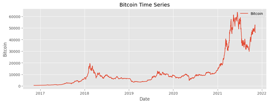
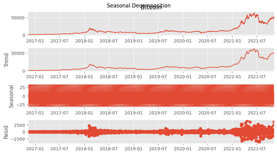
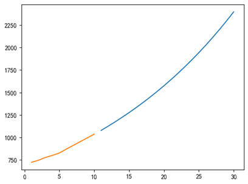
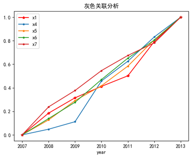

<center><h1>第8章 时间序列与投资模型</h1></center>
> 内容：@若冰（马世拓）
> 
> 审稿：@牧小熊（聂雄伟）
> 
> 排版&校对：@牧小熊（聂雄伟）

这一章主要介绍时间序列与投资模型。时间序列，顾名思义也就是按照时间排下来的序列，例如股票等。如果是短期的序列比方说只有十几条的，那么我们按照之前讲的回归那一套来做也未尝不可；但如果序列长度比较长，有几千条上万条，并且似乎一下子看不出什么规律，我们就需要引入新的方法去建模。另外，时间序列分析能够相对精准预测股市，但怎么买取决于一个优化策略。本章主要涉及到的知识点有：

- 时间序列的基本概念

- 移动平均法与指数平滑法

- ARIMA系列模型

- GARCH系列模型

- 灰色系统模型

- 组合投资中的基本策略

> 注意：第4章当中我为何强调数据体量的作用？在这个地方就体现得很好。在不同的数据体量下我们也应该选用不同的建模方法才能取得更好的建模效果。

## 8.1 时间序列的基本概念

时间序列，顾名思义就是有时间性的序列。它本质上和第四章讲到的数据也并没有太大的出入，但这种数据一个典型的特征就是有一个时间列作为索引。这个时间表示的是一个先后关系，可以以日为单位，可以以小时为单位，可以以分钟或秒为单位，这些都可以，并且它的应用范畴也很广。

### 8.1.1 时间序列的典型应用

典型的时间序列有哪些呢？天气预报中每一天的天气按照时间构成了一个序列，这属于离散的时间序列，我们通常用马尔可夫模型建模；股票当中某只股票每日的开盘价、收盘价也在变化，也认为它是一个时间序列。

时间序列的建模主要包括参数学习和预测两个方面。预测比较直观容易理解，比如对天气预报而言，我可以基于历史天气预报未来24小时内的天气情况，并且用序列建模方法可以预测得比较精准；对股票而言，我可以基于其一个月内的股价预测其接下来一周的股价变化。但参数的学习则是通过模型参数分析这个序列的特征，从而基于“领域知识”分析序列特点挖掘出一些有意思的点子。

> 注意：时间序列的预测也分为长期预测与短期预测，通常预测周期和预测精度是一对冲突概念，如果想要精准预测那么预测周期不能够太长，长期的预测只能做趋势预测，因为时间序列的预测时间太长就难以考虑环境变化与突发事件对序列的影响，所做的预测也就没有意义。

### 8.1.2 时间序列的描述与分解

在一个时间序列数据中，可以想象你的面前有一份表格：这个表格里面的内容是一条河流中水质的各种指标随着时间的变化，第一列是按日计的时间，第二列是PH，第三列是溶解氧，第四列是水体中重金属含量，第五列是水体中细菌含量。由于数据显示出随时间变化的特性，这是一个时间序列数据。每一行是在某一天的情况，我们称一行为一个“截面”，这些截面在时间轴上拼接起来构成了一个面板。

另外，定义平稳型时间序列。平稳性时间序列的定义为一个序列的均值、方差和协方差不会随着时间变化。这一定义包括三个方面的意义：第一，序列的趋势线是一条水平线；第二，序列不会某一段波动很大某一段波动很小；第三，序列不会某一段分布密集某一段分布稀疏。这是平稳序列的定义。

一个时间序列Y通常由长期趋势，季节变动，循环波动，不规则波动几部分组成：

- 长期趋势T指现象在较长时期内持续发展变化的一种趋向或状态，通常表现为一条光滑曲线趋势线。

- 季节波动S是由于季节的变化引起的现象发展水平的规则变动，通常可以表现为周期相对短一些的周期曲线。

- 循环波动I指在某段时间内，不具严格规则的周期性连续变动，通常表现为周期更长的周期曲线。

- 不规则波动C也可以叫噪声指由于众多偶然因素对时间序列造成的影响。

分解模型又分为加法模型和乘法模型。加法指的是时间序分的组成是相互独立的，四个成分都有相同的量纲。乘法模型输出部分和趋势项有相同的量纲，季节项和循环项是比例数，不规则变动项为独立随机变量序列，服从正态分布。基本分解形如：
$$
\begin{array}{c}
Y[t] = T[t] + S[t] + C[t] + I[T]\\
Y[t] = T[t]*S[t]*C[t]*I[T]
\end{array}
$$
当然，也可以把加法和乘法的分解模式进行组合。

```python
df=pd.read_csv("Bitcoin.csv")

y=df.Bitcoin

df.Date=pd.to_datetime(df.Date)

df=df.set_index(df['Date'],drop=True)

# 绘制时间序列图

plt.figure(figsize=(12, 4))

plt.plot(df.Bitcoin, label='Bitcoin')

plt.title('Bitcoin Time Series')

plt.xlabel('Date')

plt.ylabel('Bitcoin')

plt.legend()

plt.show()
```



\# 季节性分析

```python
res = sm.tsa.seasonal_decompose(df.Bitcoin, model='additive')

res.plot()

plt.suptitle('Seasonal Decomposition')

plt.show()
```



 

## 7.2 移动平均法与指数平滑法

这一讲介绍移动平均法和指数平滑法。这两种方法对于大趋势的建模是很有用的，也可以用于短期的趋势外推。在股票的K线图中，也经常可以看到移动平均法的影子，而指数平滑法则是它的一种扩展。

### 8.2.1 移动平均法

移动平均法是用一组最近的实际数据值来预测未来时间序列的一种常用方法。移动平均法适用于短期预测。当序列需求既不快速增长也不快速下降，且不存在季节性因素时，移动平均法能有效地消除预测中的随机波动，是非常有用的。移动平均法根据预测时使用的各元素的权重不同，可以分为：简单移动平均和加权移动平均。

移动平均法是一种简单平滑预测技术，它的基本思想是：根据时间序列资料、逐项推移，依次计算包含一定项数的序列平均值，以反映长期趋势的方法。因此，当时间序列的数值由于受周期变动和随机波动的影响，起伏较大，不易显示出事件的发展趋势时，使用移动平均法可以消除这些因素的影响，显示出事件的发展方向与趋势（即趋势线），然后依趋势线分析预测序列的长期趋势。

若预测目标的基本在某一个水平上下浮动，趋势线是一条水平线而非斜线更非曲线时，可以用一次移动平均方法建立预测模型。一次移动平均方法的递推公式：
$$
{M\mathop{{}}\nolimits_{{ \left( 1 \right) }}^{{t}}=M\mathop{{}}\nolimits_{{1}}^{{t-1}}+\frac{{y\mathop{{}}\nolimits_{{t}}+y\mathop{{}}\nolimits_{{t-1}}+L+y\mathop{{}}\nolimits_{{t-N+1}}}}{{N}}}
$$

$$
{M\mathop{{}}\nolimits_{{ \left( 1 \right) }}^{{0}}=\frac{{1}}{{N}}{\mathop{ \sum }\limits_{{i=1}}^{{N}}{y\mathop{{}}\nolimits_{{i}}}}}
$$

如果预测目标类似于一个线性模型（也就是趋势线是一条一次函数）会使用二次移动平均。二次移动平均方法的递推公式形如：
$$
{M\mathop{{}}\nolimits_{{ \left( 2 \right) }}^{{t}}=M\mathop{{}}\nolimits_{{ \left( 2 \right) }}^{{t}}+\frac{{M\mathop{{}}\nolimits_{{ \left( 1 \right) }}^{{t}}+M\mathop{{}}\nolimits_{{ \left( 1 \right) }}^{{t-1}}+K+M\mathop{{}}\nolimits_{{ \left( 1 \right) }}^{{t-N+1}}}}{{N}}}
$$
预测标准误差为：
$$
{S=\sqrt{{\frac{{{\mathop{ \sum }\limits_{{t=N+1}}^{{T}}{ \left( \mathop{{y}}\limits^{ᨈ}\mathop{{}}\nolimits_{{t}}-y\mathop{{}}\nolimits_{{t}} \left) \mathop{{}}\nolimits^{{2}}\right. \right. }}}}{{T-N}}}}}
$$
如果预测目标的基本趋势呈周期加线性，我们可以趋势移动平均法。形如：
$$
{\mathop{{y}}\limits^{︵}\mathop{{}}\nolimits_{{T+m}}=a\mathop{{}}\nolimits_{{T}}+b\mathop{{}}\nolimits_{{T}}m,m=1,2...}
$$

$$
{a\mathop{{}}\nolimits_{{T}}=2M\mathop{{}}\nolimits_{{ \left( 1 \right) }}^{{T}}-M\mathop{{}}\nolimits_{{ \left( 2 \right) }}^{{T}},b\mathop{{}}\nolimits_{{T}}=\frac{{2}}{{N-1}} \left( M\mathop{{}}\nolimits_{{ \left( 1 \right) }}^{{T}}-M\mathop{{}}\nolimits_{{ \left( 2 \right) }}^{{T}} \right) }
$$


> 注意：时间序列中如果出现明显的直线型或曲线型趋势，需要先把这个趋势成分分离出来以后才方便分析。无论是上面提到的二次移动平均还是趋势移动平均都是为了对这个直线型大趋势或曲线型大趋势做拟合，将其分离出来以后剩下的序列才更接近平稳。平稳序列的分析永远比非平稳的序列分析方便。

基于上面的过程，我们可以看一个例子。

```python
import numpy as np
y=np.array(y)
def MoveAverage(y,N):
    Mt=[y[0]]*N
    for i in range(N+1,len(y)+2):
        M=y[i-N-1:i-1].mean()
        Mt.append(M)
    return Mt
yt3=MoveAverage(y, 30)
yt5=MoveAverage(y, 80)
import matplotlib.pyplot as plt
plt.plot(y,label='y')
plt.plot(yt3,label='yt30')
plt.plot(yt5,label='yt80')
plt.legend()
plt.show()

```


### 8.2.2 指数平滑法

在做时序预测时，一个显然的思路是：认为离着预测点越近的点，作用越大。将权重按照指数级进行衰减，这就是指数平滑法的基本思想。这一思路显然是好理解的，毕竟在股市预测中，五年十年前的市场数据对现在意义不大，因为那个时候的宏观经济形势和现在也不同，相对而言，最近两个月的市场数据显得更为重要，在模型中这一部分数据理应被分配更大的权重。

指数平滑法有几种不同形式：一次指数平滑法针对没有趋势和季节性的序列，二次指数平滑法针对有趋势但没有季节性的序列，三次指数平滑法针对有趋势也有季节性的序列。

一次指数平滑的递推公式为：

$$
{S\mathop{{}}\nolimits_{{ \left( 1 \right) }}^{{t}}= \alpha y\mathop{{}}\nolimits_{{t}}+ \left( 1- \alpha  \left) S\mathop{{}}\nolimits_{{ \left( 1 \right) }}^{{t-1}}\right. \right. }
$$
从这一递推公式出发进行化简，可以得到：

$$
{S\mathop{{}}\nolimits_{{ \left( 1 \right) }}^{{t}}= \alpha {\mathop{ \sum }\limits_{{j=0}}^{{ \infty }}{ \left( 1- \alpha  \left) \mathop{{}}\nolimits^{{j}}y\mathop{{}}\nolimits_{{t-j}}\right. \right. }}}
$$
这里α表示修正幅度大小。通过对修正幅度的调节可以实现一次指数平滑。现在我们从一阶指数平滑到三阶指数平滑，因为更具有一般性。定义三个累计序列：

$$
{S_t^{(1)} = \alpha {y_t} + (1 - \alpha )S_{t - 1}^{(1)}}\\
{S_t^{(2)} = \alpha S_t^{(1)} + (1 - \alpha )S_{t - 1}^{(2)}}\\
{S_t^{(3)} = \alpha S_t^{(2)} + (1 - \alpha )S_{t - 1}^{(3)}}
 
$$
那么，三次指数平滑的模型被定义为：

$$
{\mathop{{y}}\limits^{ᨈ}\mathop{{}}\nolimits_{{t+m}}=a\mathop{{}}\nolimits_{{t}}+b\mathop{{}}\nolimits_{{t}}m+c\mathop{{}}\nolimits_{{t}}m\mathop{{}}\nolimits^{{2}}}
$$

$$

$$

注意：时间序列中如果应用移动平均，预测序列的数据量会少一个窗口长度；而应用指数平滑法的时候，趋势线的长度和原始序列的长度是对齐的。

同样针对上面的例子，可以用下面的代码实现不同修正幅度下的指数平滑：

```python
import numpy as np
import pandas as pd
def ExpMove(y,a):
  n=len(y)
  M=np.zeros(n)
  #M[0]=(y[0]+y[1])/2
  M[0]=y[0]
for i in range(1,len(y)):
    M[i]=a*y[i-1]+(1-a)*M[i-1]
return M
yt1=ExpMove(y,0.2)
yt2=ExpMove(y,0.5)
yt3=ExpMove(y,0.8)
s1=np.sqrt(((y-yt1)**2).mean())
s2=np.sqrt(((y-yt2)**2).mean())
s3=np.sqrt(((y-yt3)**2).mean())
d=pd.DataFrame(np.c_[y,yt1,yt2,yt3])
f=pd.ExcelWriter('exp_smooth_example.xlsx')
d.to_excel(f)
f.close()
d.plot()
plt.show()
print(d)
```


图7.3 不同修正幅度下的指数平滑

  从图7.3中可以发现，当修正幅度逐渐增大的情况下新的平滑序列越接近原始序列。与前面移动平均一样，为了对原始序列进行平滑分析其大体的趋势线可以不断调节修正幅度。

## 8.3 ARIMA系列模型

积土成山，风雨兴焉；积水成渊，蛟龙生焉。ARIMA模型实际上是由多个模型组合而来，而最起初的模型也都是针对平稳时间序列而言的。在一开始，我们会重新回温一下平稳时间序列和白噪声的概念，然后介绍如何判断一个序列是平稳时间序列的检验方法，再来介绍模型的演化和组合。

注意：如果原始序列非平稳但差分以后平稳也是可以变换使用这些模型的。

### 8.3.1 AR模型

AR模型模型，全称为自回归模型自回归模型（Autoregressive model），是统计上一种处理时间序列的方法，用同一变数例如x的之前各期，亦即${x\mathop{{}}\nolimits_{{1}}}$至${x\mathop{{}}\nolimits_{{t-1}}}$来预测本期${x\mathop{{}}\nolimits_{{t}}}$的表现，并假设它们为一线性关系。该模型描述了当前值与历史值之间的相关关系，用变量自身的历史数据对当前数据进行预测。在实际运用中，AR模型必须满足弱平稳性的要求，且必须具有自相关性，自相关系数小于0.5则不适用。

对于p阶自回归模型（AR），其递推公式形如：
$$
{\mathop{{y}}\limits^{︵}\mathop{{}}\nolimits_{{t}}=v+{\mathop{ \sum }\limits_{{i=1}}^{{q}}{ \beta \mathop{{}}\nolimits_{{i}}ℰ\mathop{{}}\nolimits_{{t-i}}+ℰ\mathop{{}}\nolimits_{{t}}}}}
$$
这个方程的形式本质上是自己与自己的历史做回归。比如，如果这个自回归模型为三项（也可以记为AR(3)的形式），那么就是以当天序列值为因变量，前面三天的序列值为自变量构建回归模型。在构建回归方程的过程中还会引入一个白噪声项，也就是取值服从标准正态分布的一个随机序列。

> 注意：时间序列中自回归的思想在后面也很有用。本质上自己和自己的历史去做回归也不一定局限在线性的模型形式，也可以用多项式去做一个广义的回归，还可以用支持向量机等构建一个机器学习模型。

### 8.3.2 MA模型

MA模型模型，全称移动平均模型移动平均模型（moving average model），是一种用于分析时间序列数据的统计模型。该模型的主要特点是当前的输出（或时间序列值）被视为过去白噪声误差的加权和。12

在MA模型中，通常包括一个常数项，用于表示时间序列的平均水平。这个模型假设时间序列的数据是平稳的，即它们的均值和方差保持不变，并且每个时间点的数据都是独立的。MA模型在信号处理信号处理、谱估计谱估计、金融分析金融分析和时间序列预测时间序列预测等领域有广泛应用。

MA模型的一个重要特征是它的自协方差函数自协方差函数和自相关系数自相关系数表现出特定的模式。自协方差函数在某个滞后阶数后趋于零，表现出q阶截尾的特性，而自相关系数则表现出q阶截尾的特性。这与自回归（AR）模型形成对比，后者的自相关系数表现出拖尾的特性。

在实际应用中，MA模型常与其他模型结合使用，如自回归滑动平均（ARMA）模型和自回归移动平均（ARIMA）模型，以适应更复杂的时间序列分析需求。

对于q阶移动平均模型（MA），其递推公式形如：

$$
{\mathop{{y}}\limits^{︵}\mathop{{}}\nolimits_{{t}}=v+{\mathop{ \sum }\limits_{{i=1}}^{{q}}{ \beta \mathop{{}}\nolimits_{{i}}ℰ\mathop{{}}\nolimits_{{t-1}}+ℰ\mathop{{}}\nolimits_{{t}}}}}
$$

> 需要注意的是，移动平均模型与自回归模型同样需要序列平稳作为先决条件。

### 8.3.3 ARMA模型和ARIMA模型

ARIMA模型是统计模型中最常见的一种用来进行时间序列预测的模型，只需要考虑内生变量而无需考虑其他外生变量，但要求序列是平稳序列或者差分后是平稳序列。ARIMA模型包含3个部分，即自回归（AR）、差分（I）和移动平均（MA）三个部分。对其每一个部分，都有其递推公式定义。当差分阶数为0的时候模型退化为ARMA模型。

①自回归模型：

对于p阶自回归模型（AR），其递推公式形如：


$$
{\mathop{{y}}\limits^{︵}\mathop{{}}\nolimits_{{t}}={\mathop{ \sum }\limits_{{i=1}}^{{p}}{ \alpha \mathop{{}}\nolimits_{{i}}y\mathop{{}}\nolimits_{{t-i}}+ℰ\mathop{{}}\nolimits_{{t}}+ \mu }}}
$$
②移动平均模型：

对于q阶移动平均模型（MA），其递推公式形如：

$$
{\mathop{{y}}\limits^{︵}\mathop{{}}\nolimits_{{t}}=v+{\mathop{ \sum }\limits_{{i=1}}^{{q}}{ \beta \mathop{{}}\nolimits_{{i}}ℰ\mathop{{}}\nolimits_{{t-i}}+ℰ\mathop{{}}\nolimits_{{t}}}}}
$$
③差分模型：

$$
{ \nabla \mathop{{}}\nolimits^{{ \left( d \right) }}y\mathop{{}}\nolimits_{{t}}= \nabla \mathop{{}}\nolimits^{{ \left( d-1 \right) }}y\mathop{{}}\nolimits_{{t}}- \nabla \mathop{{}}\nolimits^{{ \left( d-1 \right) }}y\mathop{{}}\nolimits_{{t-1}}}
$$

$$
{ \nabla \mathop{{}}\nolimits^{{ \left( 1 \right) }}y\mathop{{}}\nolimits_{{t}}=y\mathop{{}}\nolimits_{{t}}-y\mathop{{}}\nolimits_{{t-1}}}
$$


> 注意：时间序列可能自身不平稳，但是差分一次以后可能就平稳了。差分一次可能还不平稳，但差分两次就平稳了。所以定义了差分模型。但一般来讲ARIMA模型的差分次数不应该超过两次，超过两次的话应该考虑建模方法的问题了。

即由自回归模型阶数p、差分阶数d和移动平均阶数q就可以确定ARIMA模型的基本形式，我们将其简记为ARIMA(p,d,q)

$$
{ \nabla \mathop{{}}\nolimits^{{ \left( d \right) }}\mathop{{y}}\limits^{︵}\mathop{{}}\nolimits_{{t}}={\mathop{ \sum }\limits_{{i=1}}^{{p}}{ \alpha \mathop{{}}\nolimits_{{i}} \nabla \mathop{{}}\nolimits^{{ \left( d \right) }}y\mathop{{}}\nolimits_{{t-i}}+{\mathop{ \sum }\limits_{{i=1}}^{{q}}{ \beta \mathop{{}}\nolimits_{{i}}ℰ\mathop{{}}\nolimits_{{t-i}}+ℰ\mathop{{}}\nolimits_{{t}}}}}}}
$$


对于模型最优参数选择，我们使用AIC准则法（也叫赤池信息准则）分析。AIC准则由H. Akaike提出，主要用于时间序列模型的定阶，而AIC统计量的定义如下所示[13]，其中L表示模型的最大似然函数：
$$
{AIC=2 \left( p+q+d \left) -2lnL\right. \right. }
$$
当两个模型之间存在较大差异时，差异主要体现在似然函数项，当似然函数差异不显著时，模型复杂度则起主要作用，从而参数个数少的模型是较好的选择。一般而言，当模型复杂度提高时，似然函数L也会增大，从而使AIC变小，但是参数过多时，根据奥卡姆剃刀原则，模型过于复杂从而AIC增大容易造成过拟合现象。AIC不仅要提高似然项，而且引入了惩罚项，使模型参数尽可能少，有助于降低过拟合的可能性。

另一个常用的准则叫贝叶斯信息准则。贝叶斯决策理论是主观贝叶斯派归纳理论的重要组成部分。是在不完全情报下，对部分未知的状态用主观概率估计，然后用贝叶斯公式对发生概率进行修正，最后再利用期望值和修正概率做出最优决策。它的公式为：
$$
{BIC= \left( p+q+d \left) ln\text{ }n-2lnL\right. \right. }
$$
实际上，相对于AIC准则，BIC准则可能更加常用一些。

## 8.5 灰色系统模型

> 灰色系统是指系统数据有一些是未知，有一些是已知。而灰色预测就是对含有已知和未知信息的系统进行预测，寻找数据变动规律，再建立相应的微分方程模型，来对事物发展进行预测。值得一提的是，灰色理论的创始人就是华科以前还叫华中理工大学那会的邓聚龙教授哦。

### 8.5.1 灰色预测模型

我们先从最基本的GM(1,1)模型说起。若已知数据列${x\mathop{{}}\nolimits^{{ \left( 0 \right) }}}$，进行一次累加生成新的数列。我们需要针对已知数据${x\mathop{{}}\nolimits^{{ \left( 0 \right) }}= \left( x\mathop{{}}\nolimits_{{ \left( 0 \right) }}^{{t}} \left( 1 \left) ,x\mathop{{}}\nolimits_{{ \left( 0 \right) }}^{{t}} \left( 2 \left) ,...,x\mathop{{}}\nolimits_{{ \left( 0 \right) }}^{{t}} \left( n \left)  \right) \right. \right. \right. \right. \right. \right. }$进行累加，通过累加生成一阶累加序列：
$$
x\mathop{{}}\nolimits_{{ \left( 1 \right) }}^{{t}} \left( n \left) ={\mathop{ \sum }\limits_{{i=1}}^{{n}}{x\mathop{{}}\nolimits_{{ \left( 0 \right) }}^{{t}} \left( i \right) }}\right. \right. 
$$
对序列均值化可以得到：
$$
{z\mathop{{}}\nolimits^{{ \left( 1 \right) }} \left( k \left) =\frac{{x\mathop{{}}\nolimits^{{ \left( 1 \right) }} \left( k \left) +x\mathop{{}}\nolimits^{{ \left( 1 \right) }} \left( k-1 \right) \right. \right. }}{{2}}\right. \right. }
$$
虽然是个离散的差分模型，我们当它连续，建立灰微分方程：
$$
{x\mathop{{}}\nolimits^{{ \left( 0 \right) }} \left( k \left) +az\mathop{{}}\nolimits^{{ \left( 1 \right) }} \left( k \left) =b,k=2,3,...m\right. \right. \right. \right. }
$$
以及对应的白化微分方程：
$$
{\frac{{dx\mathop{{}}\nolimits^{{ \left( 1 \right) }} \left( t \right) }}{{dt}}+az\mathop{{}}\nolimits^{{ \left( 1 \right) }} \left( t \left) =b,k=2,3,...,m\right. \right. }
$$


实际上这两个方程是等价的，通过求解白化微分方程并使用最小二乘法去拟合参数，可以得到方程的解为：
$$
{u= \left[ a,b \left] \mathop{{}}\nolimits^{{T}}\right. \right. }
$$

$$
{Y= \left[ x\mathop{{}}\nolimits^{{ \left( 0 \right) }} \left( 2 \left) ,x\mathop{{}}\nolimits^{{ \left( 0 \right) }} \left( 3 \left) ,...,x \left( 0 \left)  \left( n \left)  \left] \mathop{{}}\nolimits^{{T}}\right. \right. \right. \right. \right. \right. \right. \right. \right. \right. }
$$

$$
{B= \left[ \begin{array}{*{20}{l}}{-z\mathop{{}}\nolimits^{{ \left( 1 \right) }} \left( 2 \left) \text{ }\text{ }\text{ }1\right. \right. }\\{-z\mathop{{}}\nolimits^{{ \left( 1 \right) }} \left( 3 \left) \text{ }\text{ }\text{ }1\right. \right. }\\{M\text{ }\text{ }\text{ }\text{ }\text{ }\text{ }\text{ }\text{ }\text{ }\text{ }\text{ }\text{ }M}\\{-z\mathop{{}}\nolimits^{{ \left( 1 \right) }} \left( n \left) \text{ }\text{ }\text{ }1\right. \right. }\end{array} \right] }
$$

> 注意：这一操作读者朋友可以自行在草稿纸上推导一下。

利用最小二乘法的矩阵模式，求解这个模型，可以得到方程
$$
{x\mathop{{}}\nolimits^{{ \left( 1 \right) }} \left( k+1 \left) = \left( x\mathop{{}}\nolimits^{{ \left( 0 \right) }} \left( 1 \left) -\frac{{b}}{{a}} \left) exp \left( -ak \left) +\frac{{b}}{{a}}\right. \right. \right. \right. \right. \right. \right. \right. }
$$
然后向后差分就可以得到原数据的预测值。

另一个更一般的模型是$GM（2,1）$模型。对于原始序列，得到一次累加序列$x1$和一次差分序列$x0'$，然后我们可以得到：
$$
{{x\mathop{{}}\nolimits^{{\text{'} \left( 0 \right) }} \left( k \left) +a\mathop{{}}\nolimits_{{1}}x\right. \right. }\mathop{{}}\nolimits^{{ \left( 0 \right) }} \left( k \left) +a\mathop{{}}\nolimits_{{2}}z\mathop{{}}\nolimits^{{ \left( 1 \right) }} \left( k \left) =b\right. \right. \right. \right. }
$$
这就是GM（2，1）的灰色方程。白化微分方程为：
$$
{\frac{{d\mathop{{}}\nolimits^{{2}}x\mathop{{}}\nolimits^{{ \left( 1 \right) }}}}{{dt\mathop{{}}\nolimits^{{2}}}}+a\mathop{{}}\nolimits_{{1}}\frac{{dx\mathop{{}}\nolimits^{{ \left( 1 \right) }}}}{{dt}}+a\mathop{{}}\nolimits_{{2}}x\mathop{{}}\nolimits^{{ \left( 1 \right) }}=b}
$$
同样去解这个方程即可。但求解过程较为复杂，所以我们以GM（1,1）为例实现灰色预测模型的建模：

```python
import numpy as np
import math
import matplotlib.pyplot as plt
history_data = [724.57,746.62,778.27,800.8,827.75,871.1,912.37,954.28,995.01,1037.2]
def GM11(history_data,forcast_steps):
  n = len(history_data) # 确定历史数据体量
  X0 = np.array(history_data) # 向量化
  # 级比检验的部分可以自行补充
  lambda0=np.zeros(n-1)
  for i in range(n-1):
​    if history_data[i]:
​      lambda0[i]=history_data[i+1]/history_data[i]
​    if lambda0[i]<np.exp(-2/(n+1)) or lambda0[i]>np.exp(2/n+2):
​      print("GM11模型失效")
​      return -1
  #累加生成
  history_data_agg = [sum(history_data[0:i+1]) for i in range(n)]
  X1 = np.array(history_data_agg)
  #计算数据矩阵B和数据向量Y
  B = np.zeros([n-1,2])
  Y = np.zeros([n-1,1])
  for i in range(0,n-1):
​    B[i][0] = -0.5*(X1[i] + X1[i+1])
​    B[i][1] = 1
​    Y[i][0] = X0[i+1]
  #计算GM(1,1)微分方程的参数a和b
  A = np.linalg.inv(B.T.dot(B)).dot(B.T).dot(Y)
  a = A[0][0]
  b = A[1][0]
  #建立灰色预测模型
  XX0 = np.zeros(n)
  XX0[0] = X0[0]
  for i in range(1,n):
​    XX0[i] = (X0[0] - b/a)*(1-math.exp(a))*math.exp(-a*(i))
  #模型精度的后验差检验
  e=sum(X0-XX0)/n
  #求历史数据平均值
  aver=sum(X0)/n
  #求历史数据方差
  s12=sum((X0-aver)**2)/n
  #求残差方差
  s22=sum(((X0-XX0)-e)**2)/n
  #求后验差比值
  C = s22 / s12  
  #求小误差概率
  cobt = 0
  for i in range(0,n):
​    if abs((X0[i] - XX0[i]) - e) < 0.6754*math.sqrt(s12):
​      cobt = cobt+1
​    else:
​      cobt = cobt
  P = cobt / n
  f = np.zeros(forcast_steps)
  if (C < 0.35 and P > 0.95):
​    #预测精度为一级
​    print('往后各年预测值为：')
​    for i in range(0,forcast_steps):
​      f[i] = (X0[0] - b/a)*(1-math.exp(a))*math.exp(-a*(i+n))   
​    print(f)
  else:
​    print('灰色预测法不适用')
  return f
f=GM11(history_data,20)
plt.plot(range(11,31),f)
plt.plot(range(1,11),history_data)
plt.show()
```



从图7.7可以看到，预测值相对于真实值的波动更加光滑。但从短期序列的预测情况而言，灰色预测方法的拟合程度还是相对比较高的。

> 注意：灰色预测一般适合小中期的序列预测，并且适合有指数上升趋势的序列波动。

### 7.5.2 灰色关联模型

灰色关联分析方法，是根据因素之间发展趋势的相似或相异程度，亦即“灰色关联度”，作为衡量因素间关联程度的一种方法。其思想很简单，确定参考列和比较列以后需要对数列进行无量纲化处理，然后计算灰色关联系数。这里我们使用均值处理法，即每个属性的数据除以对应均值：
$$
x( i) =\frac{{x(i)}}{\bar x(i)}
$$
灰色关联系数的定义如下：
$$
{ \zeta \mathop{{}}\nolimits_{{i}} \left( k \left) =\frac{{\mathop{{{min}}}\limits_{{s}}\mathop{{min}}\limits_{{t}}{ \left| {x\mathop{{}}\nolimits_{{0}} \left( t \left) -x\mathop{{}}\nolimits_{{s}} \left( t \right) \right. \right. } \right| }+ \rho \mathop{{{max}}}\limits_{{s}}\mathop{{max}}\limits_{{t}}{ \left| {x\mathop{{}}\nolimits_{{0}} \left( t \left) -x\mathop{{}}\nolimits_{{s}} \left( t \right) \right. \right. } \right| }}}{{{ \left| {x\mathop{{}}\nolimits_{{0}} \left( t \left) -x\mathop{{}}\nolimits_{{s}} \left( t \right) \right. \right. } \right| }+ \rho \mathop{{max}}\limits_{{s}}\mathop{{max}}\limits_{{t}}{ \left| {x\mathop{{}}\nolimits_{{0}} \left( t \left) -x\mathop{{}}\nolimits_{{s}} \left( t \right) \right. \right. } \right| }}}\right. \right. }
$$
其中ρ不超过0.5643时分辨力最好，这里为了简洁，可以取之为0.5。灰色关联度为关联系数在样本上的平均值，计算出每个属性的灰色关联度以后就可以进行分析。

**例7.1** 对表7.1中的属性进行灰色关联分析，分析x4-x7与x1之间的相关关系。

表7.1 例7.1使用数据

| **年份** | **x1** | **x2** | **x3** | **x4** | **x5** | **x6** | **x7** |
| -------- | ------ | ------ | ------ | ------ | ------ | ------ | ------ |
| 2007     | 22578  | 27569  | 4987   | 2567.7 | 267.98 | 1.5429 | 1.172  |
| 2008     | 5698   | 29484  | 5048   | 3131   | 348.51 | 1.8546 | 1.2514 |
| 2009     | 27896  | 31589  | 5129   | 3858.2 | 429.1  | 2.0369 | 1.0254 |
| 2010     | 29540  | 34894  | 5569   | 4417.7 | 541.29 | 2.2589 | 1.189  |
| 2011     | 31058  | 36478  | 5783   | 5158.1 | 647.25 | 2.4276 | 1.4213 |
| 2012     | 35980  | 38695  | 6045   | 6150.1 | 736.45 | 2.5678 | 1.5304 |
| 2013     | 39483  | 40746  | 6259   | 7002.8 | 850    | 2.8546 | 1.7421 |

可以写出以下代码：

```python
#导入相关库
import pandas as pd
import numpy as np
import matplotlib.pyplot as plt
# 解决图标题中文乱码问题
import matplotlib as mpl
mpl.rcParams['font.sans-serif'] = ['SimHei']  # 指定默认字体
mpl.rcParams['axes.unicode_minus'] = False  # 解决保存图像是负号'-'显示为方块的问题
#导入数据
data=pd.read_excel('huiseguanlian.xlsx')
# print(data)
#提取变量名 x1 -- x7
label_need=data.keys()[1:]
# print(label_need)
#提取上面变量名下的数据
data1=data[label_need].values
print(data1)
[m,n]=data1.shape #得到行数和列数
data2=data1.astype('float')
data3=data2
ymin=0
ymax=1
for j in range(0,n):
  d_max=max(data2[:,j])
  d_min=min(data2[:,j])
  data3[:,j]=(ymax-ymin)*(data2[:,j]-d_min)/(d_max-d_min)+ymin
print(data3)
# 绘制 x1,x4,x5,x6,x7 的折线图
t=range(2007,2014)
plt.plot(t,data3[:,0],'*-',c='red')
for i in range(4):
  plt.plot(t,data3[:,2+i],'.-')
plt.xlabel('year')
plt.legend(['x1','x4','x5','x6','x7'])
plt.title('灰色关联分析')
plt.show()
# 得到其他列和参考列相等的绝对值
for i in range(3,7):
  data3[:,i]=np.abs(data3[:,i]-data3[:,0])
#得到绝对值矩阵的全局最大值和最小值
data4=data3[:,3:7]
d_max=np.max(data2)
d_min=np.min(data2)
a=0.5 #定义分辨系数
# 计算灰色关联矩阵
data4=(d_min+a*d_max)/(data4+a*d_max)
xishu=np.mean(data4, axis=0)
print(' x4,x5,x6,x7 与 x1之间的灰色关联度分别为：')
print(xishu)
```



  图7.8为不同的属性与x1之间的灰色关联分析图。属性x4-x7与x1之间的灰色关联系数分别为0.95294652 0.92674346 0.9004367 0.80079348，相比于后面会讲到的皮尔逊相关系数，灰色关联分析更适合时间序列的关联分析探究。

## 7.6 组合投资问题的一些策略

> 股票序列能够相对精准地进行预测，而预测以后我们又能做什么呢？成功预测以后的结果对我们有什么价值吗？当然有。这个价值就可以让我们基于价格变化去合理安排组合投资策略，使得投资的收益最大。

### 7.6.1 股票序列与投资组合

为什么需要组合投资？如果你玩过股票（当然，我是不碰的）就会知道一个道理：“永远不要把鸡蛋放在同一个篮子里”。学会分散你的资产配置很重要，你会把你的资产分一些到不动产，分一些到古玩字画，分一些到黄金，分一些到石油，再分一些去买股票……这样某一方面亏了其他方面可以帮忙赚回来。几十年前有这样一批赌徒，他们将自己的全部身家都压在了澳门或者拉斯维加斯的赌场身上，最后一夜之间倾家荡产，这样的例子我见过，读者即使没见过看电视应该也看到过。学会分散你的资产会使你的投资不至于亏空的那么难看。

假设你现在持有的本金为单位1，在市场上进行投资选股你需要做的事情有两个：第一，从一大片股票当中选择你眼里的潜力股去投资；第二，为你的每支股票要投多少确定一个比例。你的目标很简单，是希望在下次套现的时候股票能够赚麻，所以你的投资策略与你的周期有关。比如你买股票一周以后就套现，或者一年以后再观察，是两种不同的策略。从上帝视角来看，这一问题理应使用动态规划去建模；但从现实情况出发，没人能够知道股票一周以后涨多少或者跌多少，你只能基于时间序列方法进行预测。预测出来以后怎么做呢？靠的是投资组合策略。

> 注意：这几个投资方法是在实战中最基础的方法，但风险预测同样是投资过程中重要的一环。风险并不一定是随时间的一个常量哟！

现在我以2022年美赛C题为例，现在就考虑黄金和比特币两种产品做组合投资。

### 7.6.2 马科维兹均值方差模型

马科维茨均值-方差理论被广泛用于解决最优投资组合选择问题。该理论主要通过研究各资产的预期收益、方差和协方差来确定最优投资组合。这也是第一次将数理统计方法引入投资组合理论。

马科维兹理论认为，股票的风险和收益可以通过一支股票时间序列的统计特性来描述。其中，风险可以由股票的方差或VaR来进行描述，但本质上还是通过方差来描述一支股票的风险。风险越大，赔本或者盈利的幅度也就越大，这也就像赌石中的“一刀豪宅一刀命根”。而收益则通过期望来衡量，也就是收益的平均水平越大、越稳定于一个较高的平均水平我们越开心，因为稳赚不赔。但是在计算收益的时候要注意，是套现的时候手持股票的价格与当时投资的时候投入成本的一个差额。

基于马科维兹均值方差模型，我们进行如下建模：

对于风险函数：
$$
{D \left( w\mathop{{}}\nolimits_{{1}}r\mathop{{}}\nolimits_{{b}}+w\mathop{{}}\nolimits_{{2}}r\mathop{{}}\nolimits_{{g}} \left) =w\mathop{{}}\nolimits^{{T}}{ \sum {w= \left[ \begin{array}{*{20}{l}}{ \sigma \mathop{{}}\nolimits_{{2}}^{{1}}}&{ \sigma \mathop{{}}\nolimits_{{12}}}\\{ \sigma \mathop{{}}\nolimits_{{12}}}&{ \sigma \mathop{{}}\nolimits_{{2}}^{{2}}}\end{array} \right] }}\right. \right. }
$$
其中，${ \sigma \mathop{{}}\nolimits_{{2}}^{{1}}\text{ } \sigma \mathop{{}}\nolimits_{{2}}^{{2}}}$分别代表波动率，${ \sigma \mathop{{}}\nolimits_{{2}}^{{12}}\text{ }}$代表协方差，
$$
{ \sigma \mathop{{}}\nolimits_{{12}}= \rho  \sigma \mathop{{}}\nolimits_{{1}}\text{ } \sigma \mathop{{}}\nolimits_{{2}}}
$$
对于收益函数，若考虑在第二天就将比特币和黄金全部套现，那么套现折算减去当日购买价格和交易额，所得即为预期收益：
$$
{E \left( w\mathop{{}}\nolimits_{{1}}r\mathop{{}}\nolimits_{{b}}+w\mathop{{}}\nolimits_{{2}}r\mathop{{}}\nolimits_{{g}} \left) = \left( 1- \alpha \mathop{{}}\nolimits_{{1}} \left)  \left( e\mathop{{}}\nolimits^{{r\mathop{{}}\nolimits_{{b}} \left( t \right) }}-1 \left) w\mathop{{}}\nolimits_{{1}}+ \left( 1- \alpha \mathop{{}}\nolimits_{{2}} \left)  \left( e\mathop{{}}\nolimits^{{r\mathop{{}}\nolimits_{{g}} \left( t \right) }}-1 \left) w\mathop{{}}\nolimits_{{2}}- \left(  \alpha \mathop{{}}\nolimits_{{1}}w\mathop{{}}\nolimits_{{1}}+ \alpha \mathop{{}}\nolimits_{{2}}w\mathop{{}}\nolimits_{{2}} \right) \right. \right. \right. \right. \right. \right. \right. \right. \right. \right. }
$$
那么模型形式为：
$$
{\mathop{{min}}\limits_{{w}}D \left( w,r \right) }
$$

$$
{\mathop{{max}}\limits_{{w}}E \left( w,r \right) }
$$

$$
{s.t.{ \left\{ {\begin{array}{*{20}{l}}{w\mathop{{}}\nolimits_{{1}}+w\mathop{{}}\nolimits_{{w}} \le 1}\\{-B \le w\mathop{{}}\nolimits_{{1}} \le 1}\\{-G \le w\mathop{{}}\nolimits_{{2}} \le 1}\end{array}}\right. }}
$$

这是一个多目标规划问题。为使问题简化，我们引入乘子：
$$
{\mathop{{min}}\limits_{{w}}f= \tau D \left( w,r \left) -E \left( w,r \right) \right. \right. }
$$

$$
{s.t.{ \left\{ {\begin{array}{*{20}{l}}{w\mathop{{}}\nolimits_{{1}}+w\mathop{{}}\nolimits_{{w}} \le 1}\\{-B \le w\mathop{{}}\nolimits_{{1}} \le 1}\\{-G \le w\mathop{{}}\nolimits_{{2}} \le 1}\end{array}}\right. }}
$$

对这一问题进行求解即可得到对应的策略w。

### 7.6.3 最大夏普比率模型

1990年诺贝尔经济学奖得主威廉·夏普，认为当投资者建立一个风险投资组合，他们至少应该需要投资回报达到团队220718116页25无风险投资，或更多，在此基础上，他提出了夏普比率。夏普比率是可以同时考虑回报和风险的三个经典指标之一。夏普比率的目的是计算一个投资组合每单位总风险将产生多少超额回报。如果夏普比率为正，则表示基金的回报率高于波动风险；如果为负，则表示基金的操作风险大于回报率。夏普比率越高，投资组合就越好。

夏普比率是一种综合考虑风险和收益的指标，它被定义为：
$$
{Sharp \left( w,r \left) =\frac{{E \left( w,r \left) -r\mathop{{}}\nolimits_{{f}}\right. \right. }}{{\sqrt{{D \left( w,r \right) }}}}\right. \right. }
$$
其中，${r\mathop{{}}\nolimits_{{f}}}$为无风险利率，通常取0.04作为市场估计值。此时优化问题变为：
$$
{\mathop{{min}}\limits_{{w}}-Sharp \left( w,r \right) }
$$

$$
{s.t.{ \left\{ {\begin{array}{*{20}{l}}{w\mathop{{}}\nolimits_{{1}}+w\mathop{{}}\nolimits_{{w}} \le 1}\\{-B \le w\mathop{{}}\nolimits_{{1}} \le 1}\\{-G \le w\mathop{{}}\nolimits_{{2}} \le 1}\end{array}}\right. }}
$$

可以看到本质上这个问题还是把风险和收益二者进行了一个综合。此时求解问题是一个非有理函数，可通过数值方法得到其最优解。

### 7.6.4 风险平价模型

风险平价是由爱德华·钱博士在2005年提出的。风险平价是一种资产配置哲学，它为投资组合中的不同资产分配相等的风险权重。风险平价的本质实际上是假设各种资产的夏普比率在长期内往往是一致的，以找到投资组合的长期夏普比率的最大化。

对于比特币和黄金的风险贡献率，可以分别计算为：
$$
{ \left\{ {\begin{array}{*{20}{l}}{P\mathop{{}}\nolimits_{{1}}=1-\frac{{w\mathop{{}}\nolimits_{{2}}^{{2}} \sigma \mathop{{}}\nolimits_{{2}}^{{2}}}}{{D \left( w,r \right) }}}\\{P\mathop{{}}\nolimits_{{2}}=1-\frac{{w\mathop{{}}\nolimits_{{2}}^{{1}} \sigma \mathop{{}}\nolimits_{{2}}^{{1}}}}{{D \left( w,r \right) }}}\end{array}}\right. }
$$
为使两个序列风险尽可能一致，我们构造这样一个规划模型：
$$
{\mathop{{min}}\limits_{{w}}f= \left( P\mathop{{}}\nolimits_{{1}}-P\mathop{{}}\nolimits_{{2}} \left) \mathop{{}}\nolimits^{{2}}\right. \right. }
$$

$$
{s.t.{ \left\{ {\begin{array}{*{20}{l}}{w\mathop{{}}\nolimits_{{1}}+w\mathop{{}}\nolimits_{{w}} \le 1}\\{-B \le w\mathop{{}}\nolimits_{{1}} \le 1}\\{-G \le w\mathop{{}}\nolimits_{{2}} \le 1}\end{array}}\right. }}
$$

最优的组合投资策略也就只需要对这个规划进行求解就可以了。

> 注意：这些规划本质也是可以用MATLAB去计算的，读者朋友可以结合2022MCM的C题试一试这些方法的MATLAB解。

## 7.7 马尔可夫模型

最后一节，我们针对离散时间序列讲讲马尔可夫模型。但马尔可夫模型也可以用于做连续数据的预测。

### 8.7.1 一些马尔可夫模型的概念

一个马尔科夫链是离散时间的随机过程，系统的下一个状态仅仅依赖当前的所处状态，与在它之前发生的事情无关。写成表达式就是：
$$
{P \left( X\mathop{{}}\nolimits_{{t+1}} \left| X\mathop{{}}\nolimits_{{t}},X\mathop{{}}\nolimits_{{t-1}},...,X\mathop{{}}\nolimits_{{t-k}} \left) =P \left( X\mathop{{}}\nolimits_{{t+1}} \left| X\mathop{{}}\nolimits_{{t}} \right) \right. \right. \right. \right. }
$$
马氏定理是指对于一个非周期马尔科夫链有状态转移矩阵P，有：
$$
{\mathop{{lim}}\limits_{{n \to  \infty }}P\mathop{{}}\nolimits^{{n}}={ \left[ {\begin{array}{*{20}{l}}{ \pi  \left( 1 \right) }&{ \pi  \left( 2 \right) }&{L}&{ \pi  \left( j \right) }\\{ \pi  \left( 1 \right) }&{ \pi  \left( 2 \right) }&{L}&{ \pi  \left( j \right) }\\{M}&{M}&{L}&{M}\\{ \pi  \left( 1 \right) }&{ \pi  \left( 2 \right) }&{L}&{ \pi  \left( j \right) }\end{array}\begin{array}{*{20}{l}}{L}\\{L}\\{L}\\{L}\end{array}} \right] }}
$$

$$
{ \pi  \left( j \left) ={\mathop{ \sum }\limits_{{i=0}}^{{ \infty }}{ \pi  \left( i \left) P\mathop{{}}\nolimits_{{ij}}\right. \right. }}\right. \right. }
$$

$$
{\mathop{ \sum }\limits_{{i=0}}^{{ \infty }}{ \pi \mathop{{}}\nolimits_{{i}}=1}}
$$

而细致平稳定理是说：若对于非周期马尔可夫链，
$$
{ \pi  \left( j \left) ={\mathop{ \sum }\limits_{{i=0}}^{{ \infty }}{ \pi  \left( i \left) P\mathop{{}}\nolimits_{{ij}}\right. \right. }}\right. \right. }
$$
我们就说${ \pi \mathop{{}}\nolimits_{{i}} \left( x \right) }$是马尔可夫链的平稳分布。上式被称为细致平稳条件。这两个定理是马尔可夫模型中最根本的两个定理。

马尔可夫随机场就是概率无向图模型，它是一个可以用无向图表示联合概率分布。假设有一个联合概率分布P(Y)，其中Y代表一组随机变量，该联合概率分布可以由无向图来表示，图中的每一个节点表示的是Y中的一个随机变量，图中的每条边表示的两个随机变量之间的概率依赖关系，那么这个联合概率分布P(Y)怎么样才能构成一个马尔可夫随机场呢？答案是：联合概率分布P(Y)满足成对马尔可夫性、局部马尔可夫性和全局马尔可夫性这三个中的任意一个。

隐马尔可夫模型通常用一个五元组${ \lambda = \left( N,M, \pi ,A,B \right) }$定义：

- 模型的状态数${q\mathop{{}}\nolimits_{{t}} \in { \left\{ {S\mathop{{}}\nolimits_{{1}},S\mathop{{}}\nolimits_{{2}},...,S\mathop{{}}\nolimits_{{N}}} \right\} }}$。

- 模型观测值数${O\mathop{{}}\nolimits_{{t}} \in { \left\{ {V\mathop{{}}\nolimits_{{1}},V\mathop{{}}\nolimits_{{2}},...,V\mathop{{}}\nolimits_{{M}}} \right\} }}$。

- 状态转移概率${a\mathop{{}}\nolimits_{{ij}}=P \left( q\mathop{{}}\nolimits_{{t+1}}=S\mathop{{}}\nolimits_{{j}} \left| q\mathop{{}}\nolimits_{{t}}=S\mathop{{}}\nolimits_{{i}} \right) \right. }$。

- 观察概率${b\mathop{{}}\nolimits_{{jk}}=P \left( O\mathop{{}}\nolimits_{{k}}=V\mathop{{}}\nolimits_{{k}} \left| q\mathop{{}}\nolimits_{{k}}=S\mathop{{}}\nolimits_{{j}} \right) \right. }$。

- 初始状态概率${ \pi = \left(  \pi \mathop{{}}\nolimits_{{1}}, \pi \mathop{{}}\nolimits_{{2}},..., \pi \mathop{{}}\nolimits_{{N}} \left) , \pi \mathop{{}}\nolimits_{{i}}=P \left( q\mathop{{}}\nolimits_{{i}}=S\mathop{{}}\nolimits_{{i}} \right) \right. \right. }$。

在隐马尔可夫模型中存在这样几个经典问题：

- 已知模型参数计算某个序列的概率：使用前向后向算法。

- 已知参数寻找最可能产生某一序列的隐含状态：使用维特比算法。

- 已知输出寻找最可能的状态转移与概率：使用鲍姆-韦尔奇算法

### 8.7.2 马尔可夫模型的实现

隐马尔可夫模型（Hidden Markov Model, HMM）是一个强大的工具，用于模拟具有隐藏状态的时间序列数据。HMM广泛应用于多个领域，如语音识别、自然语言处理和生物信息学等。在处理HMM时，主要集中于三个经典问题：评估问题、解码问题和学习问题。三个问题构成了使用隐马尔可夫模型时的基础框架，使得HMM不仅能够用于模拟复杂的时间序列数据，还能够从数据中学习和预测。

#### 1、评估问题

在隐马尔可夫模型（Hidden Markov Model, HMM）的应用中，评估问题是指确定一个给定的观测序列在特定HMM参数下的概率。简而言之，就是评估一个模型生成某个观测序列的可能性有多大。模型评估问题通常使用前向算法解决。前向算法是一个动态规划算法，它通过累积“前向概率”来计算给定观测序列的概率。前向概率定义为在时间点`t`观察到序列的前`t`个观测，并且系统处于状态`i`的概率。算法的核心是递推公式，它利用前一时刻的前向概率来计算当前时刻的前向概率。

```python
import numpy as np

# 定义模型参数
states = {'Rainy': 0, 'Sunny': 1}
observations = ['walk', 'shop', 'clean']
start_probability = np.array([0.6, 0.4])
transition_probability = np.array([[0.7, 0.3], [0.4, 0.6]])
emission_probability = np.array([[0.1, 0.4, 0.5], [0.6, 0.3, 0.1]])

# 观测序列，用索引表示
obs_seq = [0, 1, 2]  # 对应于 'walk', 'shop', 'clean'

# 初始化前向概率矩阵
alpha = np.zeros((len(obs_seq), len(states)))

# 初始化
alpha[0, :] = start_probability * emission_probability[:, obs_seq[0]]

# 递推计算
for t in range(1, len(obs_seq)):
    for j in range(len(states)):
        alpha[t, j] = np.dot(alpha[t-1, :], transition_probability[:, j]) * emission_probability[j, obs_seq[t]]

# 序列的总概率为最后一步的概率之和
total_prob = np.sum(alpha[-1, :])

print("Forward Probability Matrix:")
print(alpha)
print("\nTotal Probability of Observations:", total_prob)
```

#### 2、解码问题

在隐马尔可夫模型（Hidden Markov Model, HMM）中，解码问题是指给定一个观测序列和模型参数，找出最有可能产生这些观测的隐状态序列。这个问题的核心是如何从已知的观测数据中推断出隐含的状态序列，这在许多应用场景中非常有用，如语音识别、自然语言处理、生物信息学等。解决这一问题最常用的算法是维特比算法，一种动态规划方法，它通过计算并记录达到每个状态的最大概率路径，从而找到最可能的状态序列。

```python
import numpy as np

def viterbi(obs, states, start_p, trans_p, emit_p):
    """
    Viterbi Algorithm for solving the decoding problem of HMM
    obs: 观测序列
    states: 隐状态集合
    start_p: 初始状态概率
    trans_p: 状态转移概率矩阵
    emit_p: 观测概率矩阵
    """
    V = [{}]
    path = {}

    # 初始化
    for y in states:
        V[0][y] = start_p[y] * emit_p[y][obs[0]]
        path[y] = [y]

    # 对序列从第二个观测开始进行运算
    for t in range(1, len(obs)):
        V.append({})
        newpath = {}

        for cur_state in states:
            # 选择最可能的前置状态
            (prob, state) = max((V[t-1][y0] * trans_p[y0][cur_state] * emit_p[cur_state][obs[t]], y0) for y0 in states)
            V[t][cur_state] = prob
            newpath[cur_state] = path[state] + [cur_state]

        # 不更新path
        path = newpath

    # 返回最终路径和概率
    (prob, state) = max((V[len(obs) - 1][y], y) for y in states)
    return (prob, path[state])

# 定义状态、观测序列及模型参数
states = ('Rainy', 'Sunny')
observations = ('walk', 'shop', 'clean')
start_probability = {'Rainy': 0.6, 'Sunny': 0.4}
transition_probability = {
   'Rainy' : {'Rainy': 0.7, 'Sunny': 0.3},
   'Sunny' : {'Rainy': 0.4, 'Sunny': 0.6},
}
emission_probability = {
   'Rainy' : {'walk': 0.1, 'shop': 0.4, 'clean': 0.5},
   'Sunny' : {'walk': 0.6, 'shop': 0.3, 'clean': 0.1},
}

# 应用维特比算法
result = viterbi(observations,
                 states,
                 start_probability,
                 transition_probability,
                 emission_probability)
print(result)
```

#### 3、学习问题

理解隐马尔可夫模型（HMM）的模型学习问题关键在于确定模型参数，以最大化给定观测序列的出现概率。解决这一学习问题的常用方法是鲍姆-韦尔奇算法，这是一种迭代算法，通过交替执行期望步骤（E步骤）和最大化步骤（M步骤）来找到最大化观测序列概率的参数。E步骤计算隐状态的期望值，而M步骤则更新模型参数以最大化观测序列的概率。这一过程会持续重复，直至满足一定的收敛条件，如参数变化量低于特定阈值或达到预设的迭代次数。通过这种方式解决学习问题，我们可以获得一组能够很好解释给定观测数据的模型参数，这表明模型能够捕捉到观测数据中的统计规律，用于生成观测序列、预测未来观测值或识别新观测序列中的模式。

```python
import numpy as np
from hmmlearn import hmm

# 假设我们有一组观测数据，这里我们随机生成一些数据作为示例
# 实际应用中，你应该使用真实的观测数据
n_samples = 1000
n_components = 3  # 假设我们有3个隐状态
obs_dim = 2  # 观测数据的维度，例如二维的观测空间

# 随机生成观测数据
np.random.seed(42)
obs_data = np.random.rand(n_samples, obs_dim)

# 初始化GaussianHMM模型
# 这里我们指定了n_components隐状态数量和covariance_type协方差类型
model = hmm.GaussianHMM(n_components=n_components, covariance_type='full', n_iter=100)

# 使用观测数据训练模型
# 注意：实际应用中的数据可能需要更复杂的预处理步骤
model.fit(obs_data)

# 打印学习到的模型参数
print("学习到的转移概率矩阵:")
print(model.transmat_)
print("\n学习到的均值:")
print(model.means_)
print("\n学习到的协方差:")
print(model.covars_)
```

深入理解隐马尔可夫模型（HMM）处理的三种经典问题——评估问题、解码问题和学习问题，可以将通过一个完整的示例来展示这些问题的应用和解决方案。如有一个简单的天气模型，其中的状态（隐藏状态）包括晴天（Sunny）和雨天（Rainy），观测（可见状态）包括人们的三种活动：散步（Walk）、购物（Shop）和清洁（Clean）。可以使用HMM来处理评估问题、解码问题和学习问题。

```python
from hmmlearn import hmm
import numpy as np

# 定义模型参数
states = ["Rainy", "Sunny"]
n_states = len(states)

observations = ["walk", "shop", "clean"]
n_observations = len(observations)

start_probability = np.array([0.6, 0.4])

transition_probability = np.array([
    [0.7, 0.3],
    [0.4, 0.6],
])

emission_probability = np.array([
    [0.1, 0.4, 0.5],
    [0.6, 0.3, 0.1],
])

# 创建模型
model = hmm.MultinomialHMM(n_components=n_states)
model.startprob_ = start_probability
model.transmat_ = transition_probability
model.emissionprob_ = emission_probability
model.n_trials = 4

# 观测序列
obs_seq = np.array([[0], [1], [2]]).T  # 对应于观测序列 ['walk', 'shop', 'clean']

# 计算观测序列的概率
logprob = model.score(obs_seq)
print(f"Observation sequence probability: {np.exp(logprob)}")

# 继续使用上面的模型参数和观测序列

# 使用Viterbi算法找出最可能的状态序列
logprob, seq = model.decode(obs_seq, algorithm="viterbi")
print(f"Sequence of states: {', '.join(map(lambda x: states[x], seq))}")

# 假设我们只有观测序列，不知道模型参数
obs_seq = np.array([[0], [1], [2], [0], [1], [2]]).T  # 扩展的观测序列

# 初始化模型
model = hmm.MultinomialHMM(n_components=n_states, n_iter=100)
model.fit(obs_seq)

# 打印学习到的模型参数
print("Start probabilities:", model.startprob_)
print("Transition probabilities:", model.transmat_)
print("Emission probabilities:", model.emissionprob_)
```

### 8.7.3 条件随机场

条件随机场(Conditional Random Field)是 **马尔可夫随机场 + 隐状态**的特例。

区别于生成式的隐马尔可夫模型，CRF是**判别式**的。CRF 试图对多个随机变量（代表状态序列）在给定观测序列的值之后的条件概率进行建模：

给定观测序列${X= \left\{ X\mathop{{}}\nolimits_{{1}},X\mathop{{}}\nolimits_{{2}},...,X\mathop{{}}\nolimits_{{n}} \right\} }$，以及隐状态序列${Y= \left\{ y\mathop{{}}\nolimits_{{1}},y\mathop{{}}\nolimits_{{2}},...,y\mathop{{}}\nolimits_{{n}} \right\} }$的情况下，构建条件概率模型${P \left( Y \left| X \right) \right. }$。若随机变量Y构成的是一个马尔科夫随机场，则 ${P \left( Y \left| X \right) \right. }$为CRF。

借助 `sklearn_crfsuite` 库实现

```python
import sklearn_crfsuite

X_train = ...
y_train = ...

crf = sklearn_crfsuite.CRF(
    algorithm='lbfgs',
    c1=0.1,
    c2=0.1,
    max_iterations=100,
    all_possible_transitions=True
)
crf.fit(X_train, y_train)
# CPU times: user 32 s, sys: 108 ms, total: 32.1 s
# Wall time: 32.3 s
y_pred = crf.predict(X_test)
metrics.flat_f1_score(y_test, y_pred,
                      average='weighted', labels=labels)
```

## 本章小结

本章主要介绍了时间序列预测模型与投资选股模型。时间序列的核心就是如何预测，对不同体量的序列数据有不同的预测方法，例如：小体量数据我们会用回归建模；中体量数据我们开始使用灰色系统建模；中大型体量数据我们便开始使用ARIMA系列模型建模；等到数据体量为大体量数据时，我们便会使用机器学习尤其是神经网络建模，这在下一章当中就会介绍。另外，当我们能够相对准确预测未来时，我们认为还不够，因为我们最终的目的是根据我们预测的结果进行投资选股的决策，这就又是一个优化问题。在这个优化问题中，我们需要综合考虑风险和收益，想办法让收益最大风险最小，于是便有了马科维兹均值方差理论、最大夏普模型和风险平价模型。二者构成了在量化投资中的理论基石，是一个不可分的整体。

###  

 