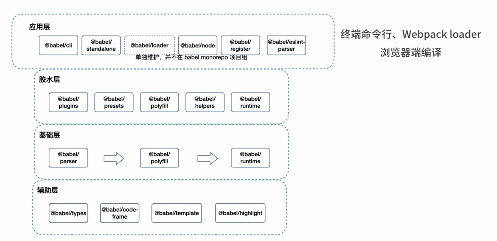

# babel

### 设计思想

1. 设计理念：可插拔，可调式，基于协定
2. 分层理念：应用层，胶水层，基础层，辅助层

<!-- core.js 核心 polyfills 在单独拆到一个包中
core.js 和 core.js-pure 分别进行引用

方案一
babel-polyfill 结合@babel/preset/env+useBuiltins(entry)+preset-envs target 的方案
 -->

### 结构

core-js: 实现的基础垫片能力，整个 core-js 的逻辑核心
core-js-pure：提供了不污染全局的垫片能力
core-js-compact：维护了按照 browserlist 规范的垫片需求数据
core-js-builder：结合 core-js-compact 以及 core-js 并利用 webpack 能力，根据需求打包出 core-js 代码
core-js-bundle
